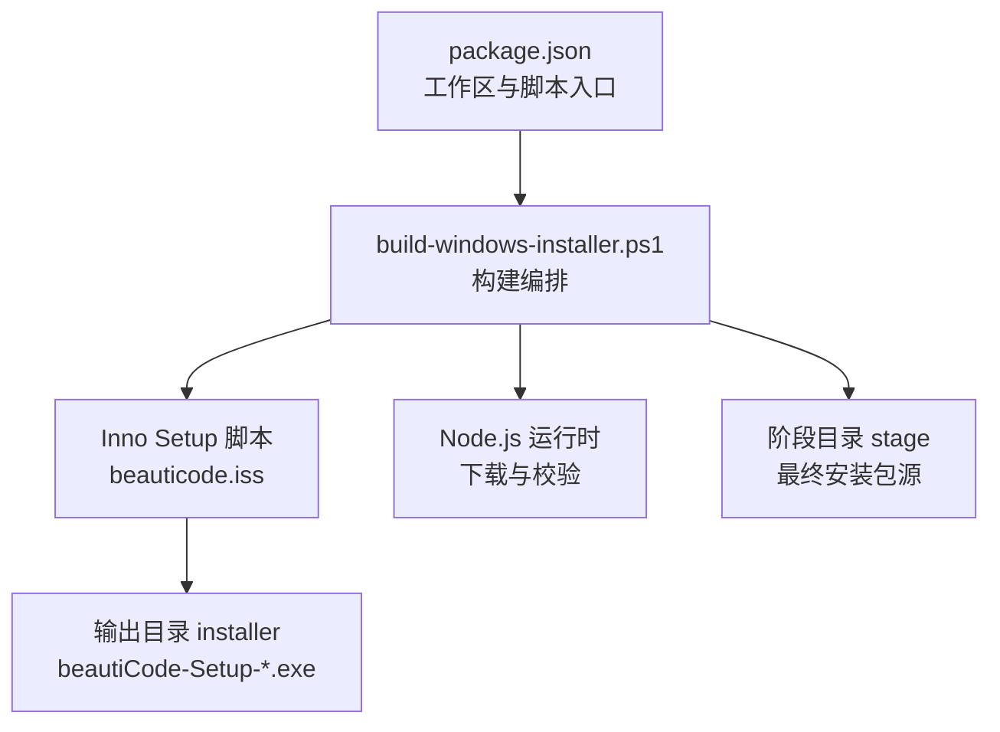
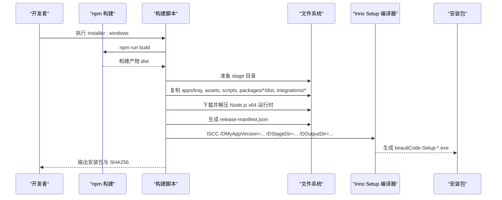
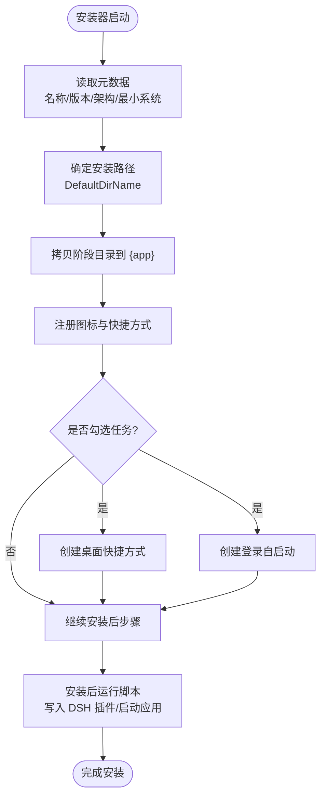
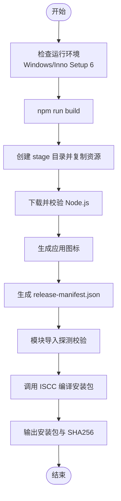
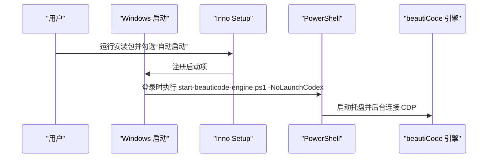
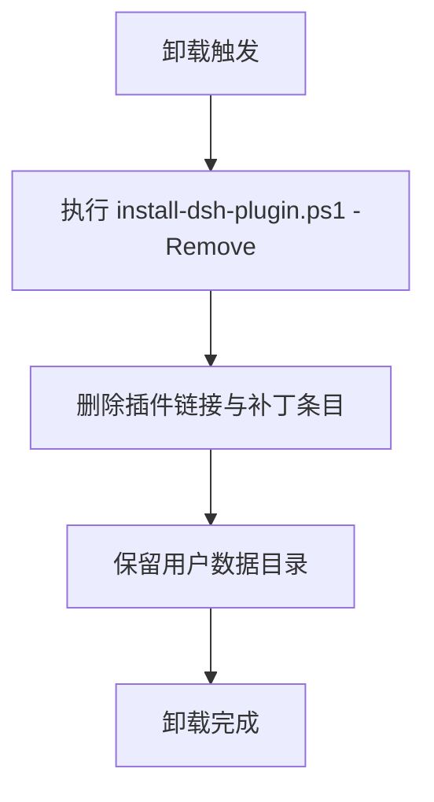
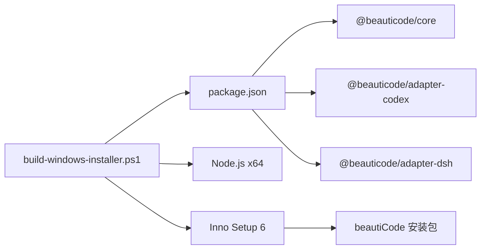

# Windows 安装包构建

<cite>
**本文引用的文件**
- [beauticode.iss](file://installer/windows/beauticode.iss)
- [build-windows-installer.ps1](file://scripts/build-windows-installer.ps1)
- [windows-installer.md](file://docs/windows-installer.md)
- [install-dsh-plugin.ps1](file://scripts/install-dsh-plugin.ps1)
- [start-beauticode.ps1](file://scripts/start-beauticode.ps1)
- [start-beauticode-engine.ps1](file://scripts/start-beauticode-engine.ps1)
- [ci.yml](file://.github/workflows/ci.yml)
- [package.json](file://package.json)
</cite>

## 目录
1. [简介](#简介)
2. [项目结构](#项目结构)
3. [核心组件](#核心组件)
4. [架构总览](#架构总览)
5. [详细组件分析](#详细组件分析)
6. [依赖关系分析](#依赖关系分析)
7. [性能考虑](#性能考虑)
8. [故障排查指南](#故障排查指南)
9. [结论](#结论)
10. [附录](#附录)

## 简介
本文件面向开发者与发布工程师，系统化说明 beautiCode 的 Windows 安装包构建流程与 Inno Setup 配置。内容覆盖：
- Inno Setup 脚本中的应用程序元数据、安装路径、压缩选项与架构兼容性
- 脚本化构建流程：依赖打包、资源文件处理、版本管理与产物校验
- 桌面快捷方式创建、自动启动配置与卸载清理机制
- 自定义安装选项：静默安装、参数传递与环境变量设置
- 构建错误排查、性能优化建议与最佳实践

该安装包将编译后的运行时与一个固定版本的 Node.js x64 运行时一并打包，目标机器无需预先安装 Node.js、npm 或 TypeScript。DeepSeek Harness（DSH）不随包分发，而是通过插件文件在用户 DSH 配置中自动“接线”。

## 项目结构
Windows 安装包由两部分组成：
- Inno Setup 脚本：定义安装器行为、文件清单、图标、任务、运行/卸载后动作等
- PowerShell 构建脚本：负责构建、阶段化产物、下载并校验 Node.js、生成清单、调用 Inno Setup 编译器

**图表来源**
- [build-windows-installer.ps1:158-173](file://scripts/build-windows-installer.ps1#L158-L173)
- [build-windows-installer.ps1:175-343](file://scripts/build-windows-installer.ps1#L175-L343)
- [beauticode.iss:18-65](file://installer/windows/beauticode.iss#L18-L65)

**章节来源**
- [package.json:1-28](file://package.json#L1-L28)
- [build-windows-installer.ps1:1-360](file://scripts/build-windows-installer.ps1#L1-L360)
- [beauticode.iss:1-66](file://installer/windows/beauticode.iss#L1-L66)

## 核心组件
- Inno Setup 脚本（beauticode.iss）
  - 应用元数据：名称、发布者、版本、最小系统版本、架构限制
  - 安装路径：默认安装到当前用户 LocalAppData 下的 Programs 目录
  - 压缩：lzma2 ultra64 与固实压缩
  - 任务：桌面快捷方式、登录自启动
  - 文件：从阶段目录递归拷贝至安装目录
  - 图标：程序图标与卸载图标
  - 运行：安装后写入 DSH 插件、可选启动应用
  - 卸载后：移除 DSH 插件接线
- 构建脚本（build-windows-installer.ps1）
  - 环境检查：仅 Windows、要求 Inno Setup 6
  - 版本管理：读取 package.json 版本号作为安装器版本
  - 构建：执行 npm run build
  - 阶段化：复制源码、dist、主题、脚本、DSH 插件文件、Node 运行时与许可证
  - 校验：Node 压缩包 SHA256 校验、内置 Node 版本一致性、模块导入探测
  - 清单：生成 release-manifest.json（包含 appVersion、nodeVersion、platform、commit、dirty、builtAtUtc）
  - 编译：解析 ISCC.exe 路径并传入 /DMyAppVersion、/DStageDir、/DOutputDir
  - 产物：输出 beautiCode-Setup-<version>-win-x64.exe 并打印 SHA256
- 辅助脚本
  - install-dsh-plugin.ps1：将 beautiCode 插件链接进用户 DSH 配置（web profile 或 home 级 cordis.patch.yml），支持移除模式
  - start-beauticode.ps1：主机选择器（Codex 或 DSH），处理托盘进程通信与切换
  - start-beauticode-engine.ps1：引擎启动器，快速检测 CDP、启动托盘、必要时启动 Codex
- CI 流水线（ci.yml）
  - 多平台/多 Node 矩阵验证类型检查、测试、构建与脚本语法解析

**章节来源**
- [beauticode.iss:1-66](file://installer/windows/beauticode.iss#L1-L66)
- [build-windows-installer.ps1:1-360](file://scripts/build-windows-installer.ps1#L1-L360)
- [install-dsh-plugin.ps1:1-309](file://scripts/install-dsh-plugin.ps1#L1-L309)
- [start-beauticode.ps1:1-514](file://scripts/start-beauticode.ps1#L1-L514)
- [start-beauticode-engine.ps1:1-447](file://scripts/start-beauticode-engine.ps1#L1-L447)
- [ci.yml:1-59](file://.github/workflows/ci.yml#L1-L59)

## 架构总览
下图展示了从构建到安装的端到端流程，包括依赖打包、资源处理、版本管理与 Inno Setup 编译。

**图表来源**
- [build-windows-installer.ps1:158-173](file://scripts/build-windows-installer.ps1#L158-L173)
- [build-windows-installer.ps1:175-343](file://scripts/build-windows-installer.ps1#L175-L343)
- [beauticode.iss:18-65](file://installer/windows/beauticode.iss#L18-L65)

## 详细组件分析

### Inno Setup 配置详解（beauticode.iss）
- 应用程序元数据
  - 名称、发布者、版本来自预处理器宏；最小系统版本为 Windows 10 1809（17763）
  - 架构限制为 x64compatible，安装器以 64 位模式运行
  - 应用互斥量用于避免重复实例
  - 版本信息字段包含产品名称、描述与公司名
- 安装路径与组名
  - 默认安装目录为 %LOCALAPPDATA%\Programs\beautiCode
  - 开始菜单组名为 beautiCode，隐藏程序组页面
- 压缩与界面
  - 使用 lzma2/ultra64 与固实压缩，现代向导风格
  - 安装时关闭相关应用但不重启
- 任务
  - 桌面快捷方式（未勾选）
  - 登录自启动（未勾选）
- 文件与图标
  - 从 StageDir 递归拷贝所有文件到 {app}
  - 安装器与应用图标来自阶段目录
- 快捷方式
  - 开始菜单项：通过 PowerShell 启动 start-beauticode.ps1
  - 桌面项：同上，受 desktopicon 任务控制
  - 自启动项：通过 PowerShell 启动 start-beauticode-engine.ps1 -NoLaunchCodex，受 autostart 任务控制
- 安装后运行
  - 写入 DSH 插件（postinstall runhidden）
  - 启动应用（跳过静默安装）
- 卸载后运行
  - 移除 DSH 插件接线（runhidden）

**图表来源**
- [beauticode.iss:18-65](file://installer/windows/beauticode.iss#L18-L65)

**章节来源**
- [beauticode.iss:1-66](file://installer/windows/beauticode.iss#L1-L66)

### 构建脚本流程（build-windows-installer.ps1）
- 前置条件与环境
  - 仅在 Windows 上运行
  - 查找 Inno Setup 6 编译器（ISCC.exe），支持多种安装位置
  - 要求 Node.js 构建环境与 npm 依赖已安装
- 版本与清单
  - 从 package.json 读取版本号，严格匹配三位数字格式
  - 生成 release-manifest.json，记录应用版本、Node 版本、平台、提交哈希、是否脏工作区、构建时间
- 阶段化与资源打包
  - 清理并创建 artifacts/windows/{stage,cache,installer}
  - 复制关键目录与文件：apps/tray、assets、scripts、packages/*/dist、integrations/deepseek-harness、主题资源、许可证等
  - 下载官方 Node.js x64 ZIP，校验 SHASUMS256.txt 与固定版本哈希
  - 将 node.exe 与 LICENSE 放入 runtime 与 licenses/node
  - 生成应用图标（从 PNG 转 ICO）
- 产物校验
  - 验证内置 Node 版本一致
  - 通过 Node 动态导入探测 adapter-codex、adapter-dsh 与 DSH 插件入口，确保模块可加载
- 编译与输出
  - 解析 ISCC.exe 路径并传入版本、阶段目录、输出目录
  - 生成安装包并计算 SHA256 摘要

**图表来源**
- [build-windows-installer.ps1:29-103](file://scripts/build-windows-installer.ps1#L29-L103)
- [build-windows-installer.ps1:158-173](file://scripts/build-windows-installer.ps1#L158-L173)
- [build-windows-installer.ps1:175-343](file://scripts/build-windows-installer.ps1#L175-L343)

**章节来源**
- [build-windows-installer.ps1:1-360](file://scripts/build-windows-installer.ps1#L1-L360)

### 桌面快捷方式与自动启动
- 桌面快捷方式
  - Inno Setup 任务 desktopicon 控制是否创建桌面快捷方式
  - 快捷方式指向 PowerShell 启动 start-beauticode.ps1，窗口隐藏执行
- 自动启动
  - 任务 autostart 在登录时启动 start-beauticode-engine.ps1 -NoLaunchCodex，避免重复启动 Codex
- 独立脚本
  - install-desktop-shortcut.ps1 可用于单独创建桌面快捷方式（非安装包场景）

**图表来源**
- [beauticode.iss:48-58](file://installer/windows/beauticode.iss#L48-L58)
- [start-beauticode-engine.ps1:13-17](file://scripts/start-beauticode-engine.ps1#L13-L17)

**章节来源**
- [beauticode.iss:48-58](file://installer/windows/beauticode.iss#L48-L58)
- [install-desktop-shortcut.ps1:1-51](file://scripts/install-desktop-shortcut.ps1#L1-L51)

### 卸载清理机制
- 卸载后运行
  - 调用 install-dsh-plugin.ps1 -Remove，移除 DSH 插件接线与集成说明文件
- 保留用户数据
  - 卸载程序文件与快捷方式，但保留 %LOCALAPPDATA%\beautiCode（媒体与主题）

**图表来源**
- [beauticode.iss:64-65](file://installer/windows/beauticode.iss#L64-L65)
- [install-dsh-plugin.ps1:252-275](file://scripts/install-dsh-plugin.ps1#L252-L275)

**章节来源**
- [beauticode.iss:64-65](file://installer/windows/beauticode.iss#L64-L65)
- [install-dsh-plugin.ps1:252-275](file://scripts/install-dsh-plugin.ps1#L252-L275)

### 自定义安装选项
- 静默安装
  - 通过 Inno Setup 的静默开关（例如 /SILENT）可跳过交互；安装后启动步骤会跳过（skipifsilent）
- 参数传递
  - 构建脚本通过 /D 预处理器宏向 Inno Setup 传递 MyAppVersion、StageDir、OutputDir
  - 安装后运行的 PowerShell 脚本可通过参数控制行为（如 -NoLaunchCodex）
- 环境变量
  - 构建脚本读取 env:OS、env:DSH_HOME、env:LOCALAPPDATA 等
  - 安装路径基于 DefaultDirName，位于 %LOCALAPPDATA%\Programs\beautiCode

**章节来源**
- [build-windows-installer.ps1:29-103](file://scripts/build-windows-installer.ps1#L29-L103)
- [build-windows-installer.ps1:338-343](file://scripts/build-windows-installer.ps1#L338-L343)
- [beauticode.iss:18-65](file://installer/windows/beauticode.iss#L18-L65)
- [install-dsh-plugin.ps1:33-41](file://scripts/install-dsh-plugin.ps1#L33-L41)

### 构建错误排查
- 常见错误与定位
  - 缺少 Inno Setup 6：脚本会抛出明确提示并给出安装命令
  - Node.js 校验失败：SHA256 不匹配或版本不一致，需检查网络与缓存
  - 阶段文件缺失：复制阶段报错，需确认构建产物与资源存在
  - 模块导入失败：adapter 或 DSH 插件无法被 Node 动态导入，需检查 dist 与依赖
  - 安装包未生成：ISCC 编译失败或未产出 EXE
- 日志与诊断
  - 启动日志位于 %LOCALAPPDATA%\beautiCode\logs（engine-launcher.log、tray.log）
  - 构建过程输出详细错误信息与堆栈

**章节来源**
- [build-windows-installer.ps1:83-103](file://scripts/build-windows-installer.ps1#L83-L103)
- [build-windows-installer.ps1:186-200](file://scripts/build-windows-installer.ps1#L186-L200)
- [build-windows-installer.ps1:223-283](file://scripts/build-windows-installer.ps1#L223-L283)
- [build-windows-installer.ps1:309-336](file://scripts/build-windows-installer.ps1#L309-L336)
- [build-windows-installer.ps1:338-353](file://scripts/build-windows-installer.ps1#L338-L353)
- [windows-installer.md:75-81](file://docs/windows-installer.md#L75-L81)

### 性能优化建议
- 构建阶段
  - 复用缓存：CI 启用 npm 缓存，减少依赖安装时间
  - 并行构建：工作区按顺序构建，可在本地并行化以提升速度
  - 增量构建：利用 dist 与源码时间戳判断是否需要重建
- 安装包体积
  - 使用 lzma2/ultra64 与固实压缩显著减小体积
  - 仅打包必要资源，避免冗余文件进入 stage
- 启动性能
  - 快速 CDP 探测与端口优先策略减少等待
  - 托盘进程与 Codex 启动解耦，提升冷启动体验

**章节来源**
- [ci.yml:10-28](file://.github/workflows/ci.yml#L10-L28)
- [beauticode.iss:34-39](file://installer/windows/beauticode.iss#L34-L39)
- [start-beauticode-engine.ps1:78-127](file://scripts/start-beauticode-engine.ps1#L78-L127)

## 依赖关系分析
- 构建脚本依赖
  - npm 工作区：@beauticode/core、@beauticode/adapter-codex、@beauticode/adapter-dsh
  - Node.js 运行时：固定版本 x64，附带许可证
  - Inno Setup 6：编译器 ISCC.exe
- 安装器依赖
  - PowerShell 5.1+：执行启动与插件脚本
  - DeepSeek Harness：用户自行安装，安装包仅写入插件接线
- CI 依赖
  - GitHub Actions：Windows/Linux 矩阵，Node 22/24，脚本语法解析

**图表来源**
- [package.json:7-22](file://package.json#L7-L22)
- [build-windows-installer.ps1:158-173](file://scripts/build-windows-installer.ps1#L158-L173)
- [build-windows-installer.ps1:83-103](file://scripts/build-windows-installer.ps1#L83-L103)

**章节来源**
- [package.json:1-28](file://package.json#L1-L28)
- [build-windows-installer.ps1:1-360](file://scripts/build-windows-installer.ps1#L1-L360)

## 性能考虑
- 构建阶段
  - 使用 npm 缓存与并行构建缩短构建时间
  - 阶段化复制只包含必要文件，减少 I/O
- 安装包阶段
  - 高压缩比降低下载与安装时间
  - 固实压缩提高解压效率
- 运行阶段
  - 快速 CDP 探测与端口优先级减少启动延迟
  - 托盘与 Codex 启动解耦，避免阻塞

[本节提供通用指导，不直接分析具体文件]

## 故障排查指南
- 构建失败
  - 检查 Inno Setup 6 是否安装且可被脚本发现
  - 确认 Node.js 版本与 SHASUMS256.txt 匹配
  - 查看阶段目录是否完整，dist 是否存在
  - 检查模块导入探测结果（adapter 与 DSH 插件）
- 安装失败
  - 确认目标系统满足最小版本要求（Windows 10 1809+）
  - 检查权限与杀毒软件拦截
  - 查看安装后日志与事件日志
- 运行问题
  - 检查托盘进程与 CDP 端口连通性
  - 查看启动日志定位错误
  - 如需重启 Codex，遵循提示进行安全重启或强制关闭

**章节来源**
- [build-windows-installer.ps1:83-103](file://scripts/build-windows-installer.ps1#L83-L103)
- [build-windows-installer.ps1:186-200](file://scripts/build-windows-installer.ps1#L186-L200)
- [build-windows-installer.ps1:309-336](file://scripts/build-windows-installer.ps1#L309-L336)
- [windows-installer.md:56-81](file://docs/windows-installer.md#L56-L81)

## 结论
本方案通过 Inno Setup 与 PowerShell 构建脚本实现了可重复、可校验、可定制的 Windows 安装包构建流程。其特点包括：
- 明确的版本管理与产物校验
- 细粒度的资源打包与压缩优化
- 灵活的快捷方式与自动启动配置
- 完善的卸载清理与用户数据保护
- 易于集成的 CI 流水线与故障排查能力

推荐在生产环境中结合代码签名证书与更严格的权限策略，进一步提升用户体验与安全性。

[本节总结整体方案，不直接分析具体文件]

## 附录
- 构建命令
  - 本地构建：npm run installer:windows
- 产物位置
  - artifacts/windows/installer/beautiCode-Setup-<version>-win-x64.exe
- 日志位置
  - %LOCALAPPDATA%\beautiCode\logs\engine-launcher.log
  - %LOCALAPPDATA%\beautiCode\logs\tray.log

**章节来源**
- [package.json:18-22](file://package.json#L18-L22)
- [build-windows-installer.ps1:348-360](file://scripts/build-windows-installer.ps1#L348-L360)
- [windows-installer.md:75-81](file://docs/windows-installer.md#L75-L81)