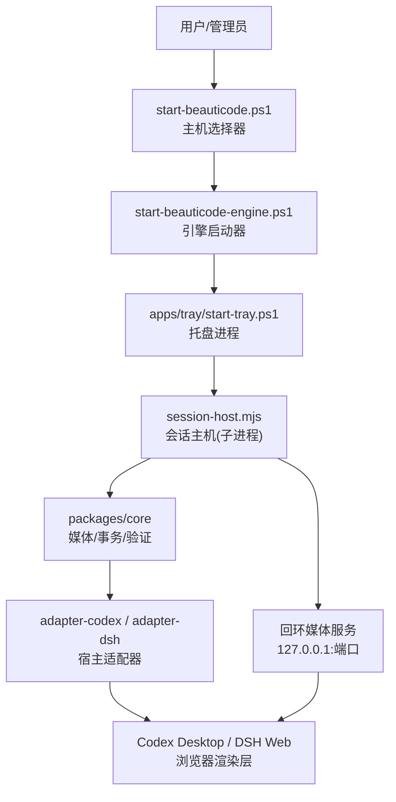
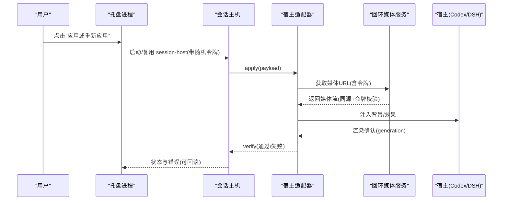
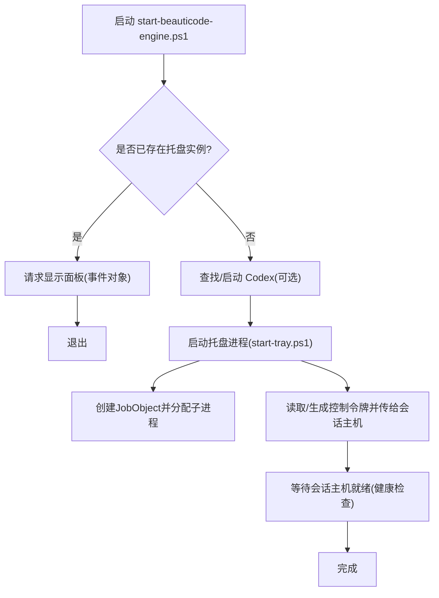
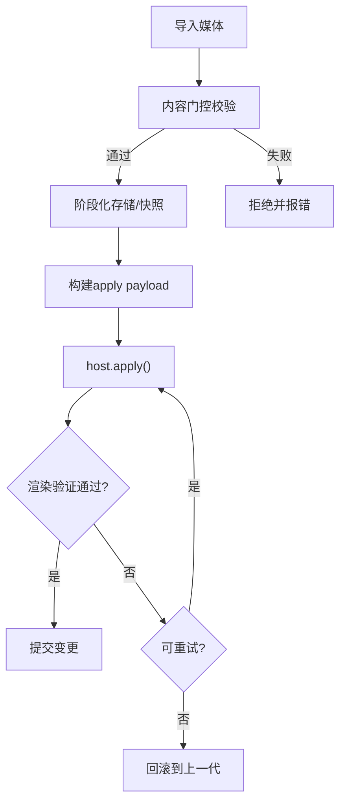
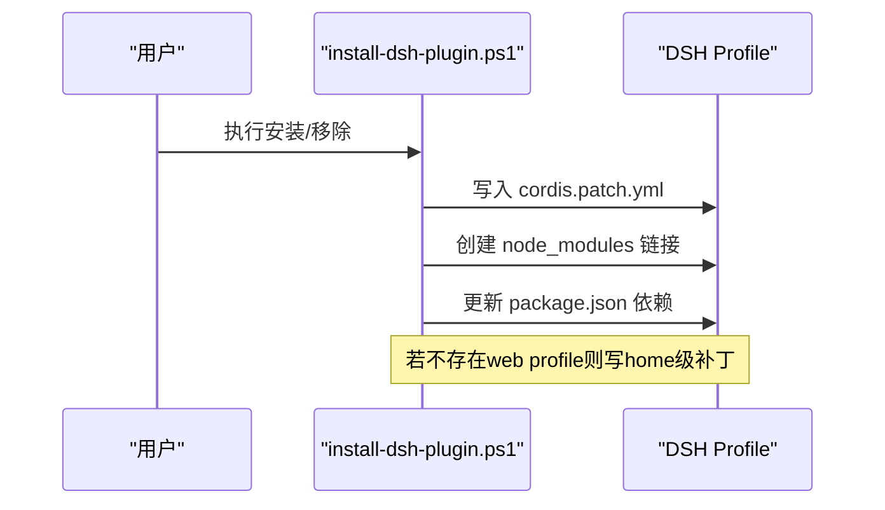
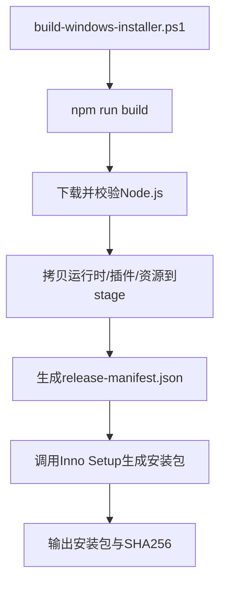
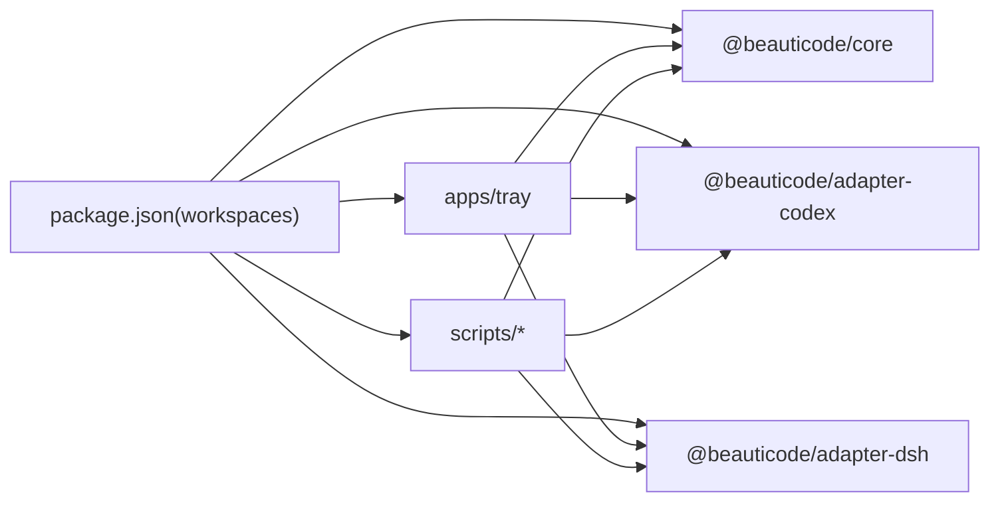

# 企业部署方案

<cite>
**本文引用的文件**
- [README.md](file://README.md)
- [package.json](file://package.json)
- [apps/tray/README.md](file://apps/tray/README.md)
- [scripts/start-beauticode.ps1](file://scripts/start-beauticode.ps1)
- [scripts/start-beauticode-engine.ps1](file://scripts/start-beauticode-engine.ps1)
- [installer/windows/beauticode.iss](file://installer/windows/beauticode.iss)
- [scripts/install-dsh-plugin.ps1](file://scripts/install-dsh-plugin.ps1)
- [scripts/build-windows-installer.ps1](file://scripts/build-windows-installer.ps1)
- [integrations/deepseek-harness/README.zh-CN.md](file://integrations/deepseek-harness/README.zh-CN.md)
- [integrations/deepseek-harness/cordis.patch.example.yml](file://integrations/deepseek-harness/cordis.patch.example.yml)
- [packages/core/src/types.ts](file://packages/core/src/types.ts)
- [packages/core/src/media-server.ts](file://packages/core/src/media-server.ts)
- [docs/security-boundaries.md](file://docs/security-boundaries.md)
</cite>

## 目录
1. [简介](#简介)
2. [项目结构](#项目结构)
3. [核心组件](#核心组件)
4. [架构总览](#架构总览)
5. [详细组件分析](#详细组件分析)
6. [依赖关系分析](#依赖关系分析)
7. [性能与容量规划](#性能与容量规划)
8. [监控、日志与健康检查](#监控日志与健康检查)
9. [权限模型与安全策略](#权限模型与安全策略)
10. [配置管理](#配置管理)
11. [批量部署与分发](#批量部署与分发)
12. [故障恢复、备份与灾难恢复](#故障恢复备份与灾难恢复)
13. [排障指南](#排障指南)
14. [结论](#结论)

## 简介
本方案面向企业运维团队，提供 beautiCode 在企业生产环境的完整部署与维护参考。beautiCode 是一个本地背景工具，主要面向 DeepSeek Harness（DSH）和 Codex Desktop，通过托盘进程、会话主机与宿主适配器将图片/视频作为网页背景注入到宿主窗口中。方案覆盖单机部署、多用户环境、无头服务器模式；涵盖配置管理、权限与安全、监控与日志、批量部署、故障恢复与灾备等关键主题。

## 项目结构
仓库采用 monorepo 组织：
- apps/tray：Windows 系统托盘入口与控制面板，启动并管理 session-host 进程，提供控制通道与菜单操作。
- packages/core：核心媒体处理、事务化应用、回环媒体服务、验证与回滚逻辑。
- packages/adapter-codex / adapter-dsh：针对 Codex 与 DSH 的宿主适配器，负责 CDP/协议对接与渲染验证。
- integrations/deepseek-harness：DSH Cordis 插件，向 DSH Web 注入客户端并提供本机鉴权接口。
- scripts：构建、安装、打包与运行脚本（PowerShell/Node）。
- installer/windows：Inno Setup 安装包定义，生成 Windows 安装包。

**图示来源**
- [scripts/start-beauticode.ps1:1-514](file://scripts/start-beauticode.ps1#L1-L514)
- [scripts/start-beauticode-engine.ps1:1-447](file://scripts/start-beauticode-engine.ps1#L1-L447)
- [apps/tray/README.md:1-85](file://apps/tray/README.md#L1-L85)
- [packages/core/src/types.ts:64-214](file://packages/core/src/types.ts#L64-L214)
- [packages/core/src/media-server.ts:422-467](file://packages/core/src/media-server.ts#L422-L467)

**章节来源**
- [README.md:19-175](file://README.md#L19-L175)
- [package.json:1-28](file://package.json#L1-L28)

## 核心组件
- 托盘进程与控制器：提供 UI、热键、主题保存、视频声音控制、摸鱼模式等；通过随机令牌与回环 HTTP 控制会话主机。
- 会话主机：以 Node 子进程运行，负责 CDP/协议连接、媒体导入校验、事务化应用到宿主、渲染验证与回滚。
- 宿主适配器：封装 Codex 与 DSH 的差异，统一 apply/verify 契约。
- 回环媒体服务：仅绑定 127.0.0.1，使用路径级令牌与同源校验提供受控媒体访问。
- DSH 插件：Cordis 插件，向 DSH Web 注入客户端，暴露安全边界内的控制端点。

**章节来源**
- [apps/tray/README.md:1-85](file://apps/tray/README.md#L1-L85)
- [packages/core/src/types.ts:142-214](file://packages/core/src/types.ts#L142-L214)
- [integrations/deepseek-harness/README.zh-CN.md:1-49](file://integrations/deepseek-harness/README.zh-CN.md#L1-L49)

## 架构总览
beautiCode 由“托盘 + 会话主机 + 适配器 + 宿主”构成。托盘通过互斥量与事件对象协调单实例与面板显示；会话主机在后台连接宿主 CDP/协议，执行媒体导入、事务化应用与渲染验证；媒体通过回环服务以令牌保护；DSH 插件在 DSH Web 侧接收应用指令并反馈渲染结果。

**图示来源**
- [scripts/start-beauticode-engine.ps1:239-350](file://scripts/start-beauticode-engine.ps1#L239-L350)
- [apps/tray/start-tray.ps1:687-798](file://apps/tray/start-tray.ps1#L687-L798)
- [packages/core/src/types.ts:142-214](file://packages/core/src/types.ts#L142-L214)
- [packages/core/src/media-server.ts:422-467](file://packages/core/src/media-server.ts#L422-L467)

## 详细组件分析

### 托盘进程与启动器
- 启动器负责：单实例互斥、快速 CDP 探测、并行拉起托盘与宿主、健康等待与提示。
- 托盘负责：创建 JobObject 管理子进程生命周期、读写 tray-claim/injector.lock、健康检查、接管已有会话、生成随机控制令牌并通过子进程 stdin 传递，避免进入命令行。
- 支持目标主机切换（Codex/DSH），并在 DSH 模式下自动写入插件链接与补丁。

**图示来源**
- [scripts/start-beauticode-engine.ps1:274-430](file://scripts/start-beauticode-engine.ps1#L274-L430)
- [apps/tray/start-tray.ps1:71-124](file://apps/tray/start-tray.ps1#L71-L124)
- [apps/tray/start-tray.ps1:687-798](file://apps/tray/start-tray.ps1#L687-L798)

**章节来源**
- [scripts/start-beauticode.ps1:1-514](file://scripts/start-beauticode.ps1#L1-L514)
- [scripts/start-beauticode-engine.ps1:1-447](file://scripts/start-beauticode-engine.ps1#L1-L447)
- [apps/tray/start-tray.ps1:1-800](file://apps/tray/start-tray.ps1#L1-L800)

### 会话主机与媒体事务
- 会话主机以 Node 子进程运行，接受托盘传入的主机类型、数据根、端口等参数。
- 核心流程：导入媒体 → 校验（扩展名、大小、魔数、ftyp）→ 阶段化存储 → 构建 apply payload → 调用适配器 apply → 渲染验证 → 失败重试/回滚。
- 媒体服务仅在 127.0.0.1 暴露，按路径令牌与同源限制访问。

**图示来源**
- [packages/core/src/types.ts:64-214](file://packages/core/src/types.ts#L64-L214)
- [packages/core/src/media-server.ts:422-467](file://packages/core/src/media-server.ts#L422-L467)

**章节来源**
- [packages/core/src/types.ts:64-214](file://packages/core/src/types.ts#L64-L214)
- [packages/core/src/media-server.ts:422-467](file://packages/core/src/media-server.ts#L422-L467)

### DSH 插件与补丁
- 插件通过 Cordis 注入 DSH Web，提供背景控制能力（图片/视频、播放位置、静音、摸鱼、清除）。
- 安装脚本会在用户 DSH profile 中建立符号链接与补丁条目，或在未初始化时写入 home 级补丁，确保首次 dsh web 即加载插件。
- 卸载时清理补丁、链接与依赖项。

**图示来源**
- [scripts/install-dsh-plugin.ps1:1-309](file://scripts/install-dsh-plugin.ps1#L1-L309)
- [integrations/deepseek-harness/cordis.patch.example.yml:1-14](file://integrations/deepseek-harness/cordis.patch.example.yml#L1-L14)

**章节来源**
- [scripts/install-dsh-plugin.ps1:1-309](file://scripts/install-dsh-plugin.ps1#L1-L309)
- [integrations/deepseek-harness/README.zh-CN.md:1-49](file://integrations/deepseek-harness/README.zh-CN.md#L1-L49)

### Windows 安装包与发布流水线
- 构建脚本会编译产物、下载并校验 Node.js 二进制、复制运行时文件、生成 release-manifest.json，最后调用 Inno Setup 生成安装包。
- 安装包默认安装到 %LOCALAPPDATA%\Programs\beautiCode，创建桌面快捷方式与可选开机自启，并在安装后自动写入 DSH 插件。

**图示来源**
- [scripts/build-windows-installer.ps1:1-360](file://scripts/build-windows-installer.ps1#L1-L360)
- [installer/windows/beauticode.iss:1-66](file://installer/windows/beauticode.iss#L1-L66)

**章节来源**
- [scripts/build-windows-installer.ps1:1-360](file://scripts/build-windows-installer.ps1#L1-L360)
- [installer/windows/beauticode.iss:1-66](file://installer/windows/beauticode.iss#L1-L66)

## 依赖关系分析
- 顶层工作区包含 core、adapter-codex、adapter-dsh 三个包，tray 应用与多个 PowerShell/Node 脚本。
- 构建与发布依赖 Inno Setup 与 Node.js 固定版本；运行时依赖宿主（Codex/DSH）提供的 CDP/协议能力。
- 托盘与引擎通过 Win32 互斥量与事件对象进行进程间协调，避免重复实例与冲突。

**图示来源**
- [package.json:1-28](file://package.json#L1-L28)

**章节来源**
- [package.json:1-28](file://package.json#L1-L28)

## 性能与容量规划
- 启动优化：托盘启动前优先探测常见 CDP 端口，避免全量进程扫描；dist 缺失时才触发 npm build。
- 资源占用：托盘使用轻量 WinForms 控件与 Node 会话主机，媒体服务仅回环暴露；建议为每个用户独立 data root 以避免锁竞争。
- 并发与锁：通过互斥量与 injector.lock 防止多实例同时注入同一宿主；JobObject 保证子进程随父进程回收。
- 网络：所有 CDP 与媒体服务仅绑定 127.0.0.1，降低外部攻击面。

[本节为通用指导，不直接分析具体文件]

## 监控、日志与健康检查
- 日志位置：
  - 引擎启动器日志：%LOCALAPPDATA%\beautiCode\logs\engine-launcher.log
  - 托盘日志：%LOCALAPPDATA%\beautiCode\logs\tray.log
  - DSH 插件安装日志：同上目录下的 dsh-plugin-install.log
- 健康检查：
  - 托盘对会话主机暴露的 /health 端点进行健康探测（需携带控制令牌）。
  - 引擎启动器通过 TCP 短连接与 /json/version 快速判断 CDP 可用性。
- 指标采集建议：
  - 记录托盘/会话主机进程存活、CDP 连通性、apply 成功率、渲染验证失败率、媒体文件大小分布。
  - 结合 Windows Event Log 或集中式日志平台收集。

**章节来源**
- [scripts/start-beauticode-engine.ps1:27-53](file://scripts/start-beauticode-engine.ps1#L27-L53)
- [apps/tray/start-tray.ps1:16-32](file://apps/tray/start-tray.ps1#L16-L32)
- [scripts/install-dsh-plugin.ps1:46-60](file://scripts/install-dsh-plugin.ps1#L46-L60)
- [apps/tray/start-tray.ps1:561-570](file://apps/tray/start-tray.ps1#L561-L570)

## 权限模型与安全策略
- 信任域：
  - 数据根（默认 %LOCALAPPDATA%\beautiCode）为受控目录。
  - 导入媒体视为不可信输入，经门控校验后复制到数据根。
  - 回环媒体服务受令牌与同源保护。
  - 宿主渲染层视为不可信对端，需 generation 守卫与回滚。
- 令牌与头部：
  - 媒体认证头：X-BeautiCode-Media-Token。
  - 控制令牌：每托盘进程随机生成，通过子进程 stdin 传递，不入命令行与环境继承。
- 网络限制：
  - CDP 与媒体服务仅绑定 127.0.0.1，禁止 LAN 绑定。
- 文件系统限制：
  - 拒绝符号链接与重解析点；通过 .beauticode-root.json 标记所有权，防止误用非空目录作为 data root。
- 最小权限：
  - 安装包使用最低权限；托盘/引擎通过互斥量与事件对象协作，避免越权。

**章节来源**
- [docs/security-boundaries.md:1-51](file://docs/security-boundaries.md#L1-L51)
- [apps/tray/README.md:75-85](file://apps/tray/README.md#L75-L85)
- [apps/tray/start-tray.ps1:687-798](file://apps/tray/start-tray.ps1#L687-L798)
- [packages/core/src/media-server.ts:422-467](file://packages/core/src/media-server.ts#L422-L467)

## 配置管理
- 环境变量
  - BEAUTICODE_DATA_ROOT：覆盖数据根路径（托盘与 DSH 插件需一致）。
  - DSH_HOME：DSH 主目录（默认 %USERPROFILE%\.dsh）。
  - BEAUTICODE_SKIN_CENTER：启用皮肤中心远程目录。
- 配置文件与模板
  - DSH 补丁：cordis.patch.yml（profile 或 home 级），用于注入 beautiCode 插件。
  - 主题与皮肤：assets/themes/internal-beyond 下内置主题资源。
- 密钥管理
  - 控制令牌：每托盘进程随机生成，仅通过子进程 stdin 传递，不在命令行或持久化文件中留存。
  - 媒体令牌：基于路径的短期能力令牌，配合同源校验，不泄露完整令牌串。

**章节来源**
- [scripts/install-dsh-plugin.ps1:33-45](file://scripts/install-dsh-plugin.ps1#L33-L45)
- [integrations/deepseek-harness/cordis.patch.example.yml:1-14](file://integrations/deepseek-harness/cordis.patch.example.yml#L1-L14)
- [apps/tray/start-tray.ps1:500-509](file://apps/tray/start-tray.ps1#L500-L509)
- [integrations/deepseek-harness/README.zh-CN.md:1-49](file://integrations/deepseek-harness/README.zh-CN.md#L1-L49)

## 批量部署与分发
- 标准安装
  - 使用安装包：构建脚本产出安装包，安装后自动写入 DSH 插件并创建快捷方式。
  - 手动安装：通过 install-dsh-plugin.ps1 将插件链接到用户 DSH profile。
- 组策略与开机自启
  - 安装包支持“登录 Windows 后自动启动”，实际通过注册表启动项指向 engine 脚本（-NoLaunchCodex）。
  - 可通过组策略分发安装包与设置开机自启任务。
- 软件分发系统
  - 使用构建脚本生成安装包与 SHA256，纳入企业分发渠道（SCCM/Intune/GPO）。
  - 建议在预检环境中验证 Node.js 版本、Inno Setup 编译器与宿主兼容性。
- 无头服务器模式
  - 在无 GUI 场景下，可仅运行 DSH Web（容器/服务），通过 install-dsh-plugin.ps1 注入插件，并由其他编排系统触发 dsh web。
  - 注意：beautiCode 不启动 DSH，需由外部进程管理其生命周期。

**章节来源**
- [scripts/build-windows-installer.ps1:1-360](file://scripts/build-windows-installer.ps1#L1-L360)
- [installer/windows/beauticode.iss:48-66](file://installer/windows/beauticode.iss#L48-L66)
- [scripts/install-dsh-plugin.ps1:1-309](file://scripts/install-dsh-plugin.ps1#L1-L309)
- [integrations/deepseek-harness/README.zh-CN.md:1-49](file://integrations/deepseek-harness/README.zh-CN.md#L1-L49)

## 故障恢复、备份与灾难恢复
- 故障恢复
  - 应用失败：核心事务化流程在渲染验证失败时尝试重试或回滚到上一代。
  - 宿主重启：当检测到宿主已运行但无可用 CDP，会提示用户安全重启以恢复当前背景。
  - 托盘异常：托盘捕获异常并弹出错误信息，附带日志路径。
- 备份策略
  - 定期备份数据根（默认 %LOCALAPPDATA%\beautiCode），包含主题、媒体缓存与注入锁文件。
  - 备份 DSH profile 中的 cordis.patch.yml 与 package.json 依赖项。
- 灾难恢复
  - 重装步骤：重新运行安装包或从源码安装插件；恢复数据根与 DSH 补丁即可恢复背景与主题。
  - 多用户隔离：每个用户拥有独立 data root 与 DSH profile，避免共享导致的状态冲突。

**章节来源**
- [packages/core/src/types.ts:142-214](file://packages/core/src/types.ts#L142-L214)
- [scripts/start-beauticode-engine.ps1:352-426](file://scripts/start-beauticode-engine.ps1#L352-L426)
- [apps/tray/start-tray.ps1:34-60](file://apps/tray/start-tray.ps1#L34-L60)

## 排障指南
- 常见问题
  - 无法找到宿主：检查托盘是否成功拉起会话主机，查看 tray.log 与 engine-launcher.log。
  - CDP 不可用：确认宿主已开启调试端口且可被 127.0.0.1 访问；必要时重启宿主。
  - 插件未生效：确认 DSH profile 已包含 cordis.patch.yml 条目，或运行 install-dsh-plugin.ps1 重新写入。
  - 媒体无法播放：检查媒体格式（图片/MP4）、大小限制与文件完整性；确认媒体服务令牌与同源正确。
- 诊断要点
  - 查看 injector.lock 与 tray-claim.json 确定是否存在残留进程。
  - 使用托盘“应用或重新应用”触发一次完整流程，观察日志中的阶段耗时与错误。
  - 在 DSH Web 控制台确认背景注入与 generation 变化。

**章节来源**
- [scripts/start-beauticode-engine.ps1:27-53](file://scripts/start-beauticode-engine.ps1#L27-L53)
- [apps/tray/start-tray.ps1:540-559](file://apps/tray/start-tray.ps1#L540-L559)
- [scripts/install-dsh-plugin.ps1:252-309](file://scripts/install-dsh-plugin.ps1#L252-L309)

## 结论
本方案以托盘与会话主机为核心，结合宿主适配器与回环媒体服务，提供了安全、可控、可观测的背景注入能力。通过标准化安装与批量分发脚本，可在企业环境中实现稳定部署；借助健康检查与日志体系，便于日常运维与问题定位。建议在生产环境遵循最小权限、回环网络、令牌保护与数据根隔离原则，并结合备份与灾备计划保障业务连续性。