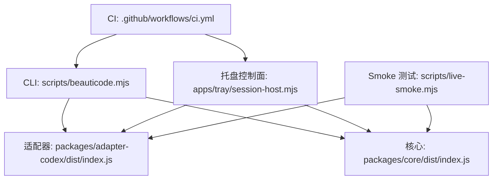
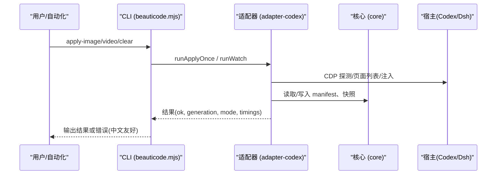
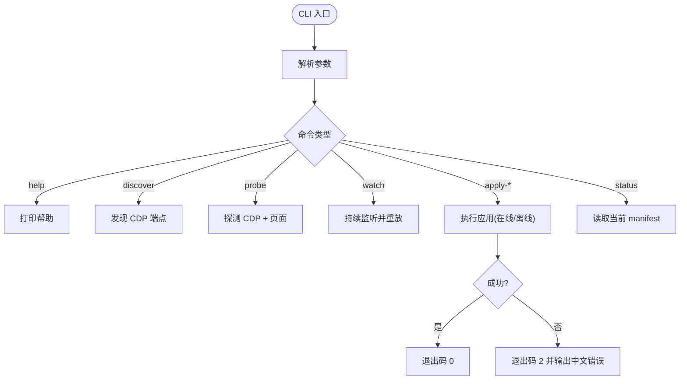
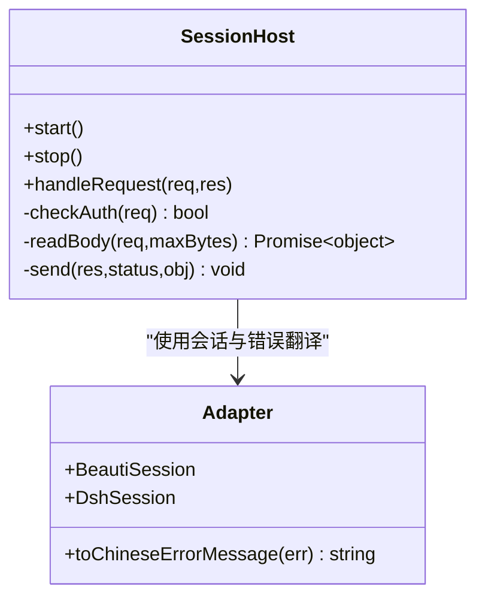
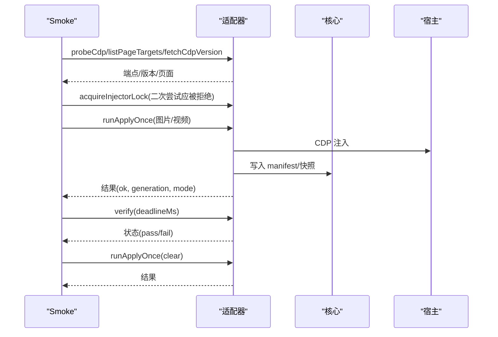
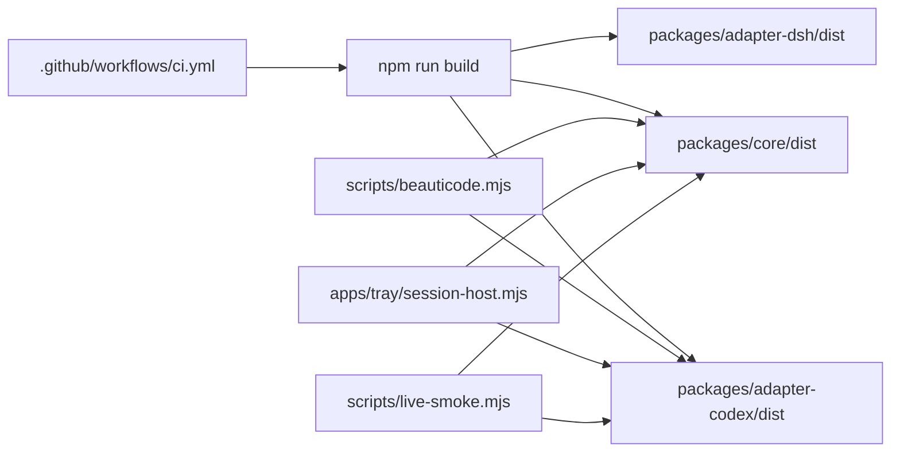

# 运维维护指南

<cite>
**本文引用的文件**
- [README.md](file://README.md)
- [package.json](file://package.json)
- [.github/workflows/ci.yml](file://.github/workflows/ci.yml)
- [scripts/beauticode.mjs](file://scripts/beauticode.mjs)
- [apps/tray/README.md](file://apps/tray/README.md)
- [apps/tray/session-host.mjs](file://apps/tray/session-host.mjs)
- [scripts/live-smoke.mjs](file://scripts/live-smoke.mjs)
- [docs/security-boundaries.md](file://docs/security-boundaries.md)
- [docs/live-smoke.md](file://docs/live-smoke.md)
- [packages/core/src/constants.ts](file://packages/core/src/constants.ts)
- [packages/core/src/types.ts](file://packages/core/src/types.ts)
- [packages/core/src/paths.ts](file://packages/core/src/paths.ts)
- [packages/core/src/error-message.ts](file://packages/core/src/error-message.ts)
- [integrations/deepseek-harness/host-apply.mjs](file://integrations/deepseek-harness/host-apply.mjs)
</cite>

## 目录
1. [简介](#简介)
2. [项目结构](#项目结构)
3. [核心组件](#核心组件)
4. [架构总览](#架构总览)
5. [详细组件分析](#详细组件分析)
6. [依赖关系分析](#依赖关系分析)
7. [性能考虑](#性能考虑)
8. [故障排除手册](#故障排除手册)
9. [更新管理流程](#更新管理流程)
10. [安全审计与合规检查](#安全审计与合规检查)
11. [结论](#结论)

## 简介
本指南面向运维人员，提供 beautiCode 系统的日常监控、日志分析、性能调优、故障排除、更新管理与安全合规的完整参考。系统为 DeepSeek Harness 与 Codex Desktop 提供本地图片/视频背景能力，通过 CDP（Chromium DevTools Protocol）注入与验证，确保“失败即关闭”的安全策略与可回滚的一致性。

## 项目结构
仓库采用 monorepo 组织：
- CLI 入口与脚本：scripts/*
- Windows 托盘与控制面：apps/tray/*
- 核心存储与类型：packages/core/*
- 适配器（Codex/Dsh）：packages/adapter-*
- 集成与文档：integrations/*, docs/*
- CI/CD：.github/workflows/*

**图表来源**
- [scripts/beauticode.mjs:18-34](file://scripts/beauticode.mjs#L18-L34)
- [apps/tray/session-host.mjs:148-198](file://apps/tray/session-host.mjs#L148-L198)
- [scripts/live-smoke.mjs:161-171](file://scripts/live-smoke.mjs#L161-L171)
- [.github/workflows/ci.yml:18-28](file://.github/workflows/ci.yml#L18-L28)

**章节来源**
- [README.md:19-137](file://README.md#L19-L137)
- [package.json:1-27](file://package.json#L1-L27)
- [.github/workflows/ci.yml:1-59](file://.github/workflows/ci.yml#L1-L59)

## 核心组件
- CLI 工具：提供 discover/probe/apply/watch/status 等命令，支持离线模式与在线注入验证。
- 托盘会话主机：在 127.0.0.1 暴露受控 HTTP API，负责应用背景、主题、摸鱼模式、声音静音等。
- 适配器层：封装对 Codex/Dsh 的 CDP 探测、页面发现、注入与验证。
- 核心存储与常量：数据根目录布局、媒体大小限制、扩展名白名单、manifest 与主题元数据。
- Smoke 测试：端到端闭环验证，覆盖 CDP 探测、双锁、错误媒体拒绝、注入验证、清理等。

**章节来源**
- [scripts/beauticode.mjs:40-73](file://scripts/beauticode.mjs#L40-L73)
- [apps/tray/session-host.mjs:5-24](file://apps/tray/session-host.mjs#L5-L24)
- [packages/core/src/constants.ts:1-62](file://packages/core/src/constants.ts#L1-L62)
- [scripts/live-smoke.mjs:53-62](file://scripts/live-smoke.mjs#L53-L62)

## 架构总览
系统由三层组成：
- 控制平面：CLI 与托盘 session-host，统一对外暴露操作接口。
- 适配平面：adapter-codex/adapter-dsh，负责 CDP 连接、页面选择、注入与验证。
- 核心平面：core，负责数据根目录、媒体校验、事务提交与回滚、主题持久化。

**图表来源**
- [scripts/beauticode.mjs:332-418](file://scripts/beauticode.mjs#L332-L418)
- [scripts/live-smoke.mjs:238-292](file://scripts/live-smoke.mjs#L238-L292)
- [packages/core/src/types.ts:149-153](file://packages/core/src/types.ts#L149-L153)

## 详细组件分析

### CLI 工具（scripts/beauticode.mjs）
- 参数解析与帮助：支持 --port/--discover/--data-root/--verify-ms/--url-prefix/--allow-http。
- 健康探测：probe 返回端口、浏览器身份、页面目标；discover 列出可用 CDP 端点。
- 应用流程：apply-image/video/clear 支持在线注入+验证，或离线事务（仅存储与媒体校验）。
- 错误处理：将底层错误转换为中文提示，并给出修复建议（如未发现 CDP、另一注入器占用、身份变化）。

**图表来源**
- [scripts/beauticode.mjs:76-131](file://scripts/beauticode.mjs#L76-L131)
- [scripts/beauticode.mjs:224-298](file://scripts/beauticode.mjs#L224-L298)
- [scripts/beauticode.mjs:332-418](file://scripts/beauticode.mjs#L332-L418)

**章节来源**
- [scripts/beauticode.mjs:14-17](file://scripts/beauticode.mjs#L14-L17)
- [scripts/beauticode.mjs:133-171](file://scripts/beauticode.mjs#L133-L171)
- [scripts/beauticode.mjs:188-222](file://scripts/beauticode.mjs#L188-L222)

### 托盘会话主机（apps/tray/session-host.mjs）
- 安全控制面：仅在 127.0.0.1 监听，所有写操作需 Bearer Token 鉴权。
- 路由集合：/health、/status、/apply/image、/apply/video、/apply/clear、/reapply、/theme/*、/mode/*、/discover、/shutdown。
- 会话管理：支持 deferHostConnect、自动发现、超时与最大请求数配置。
- 优雅关闭：释放控制文件、停止会话、关闭连接、设置退出码。

**图表来源**
- [apps/tray/session-host.mjs:260-288](file://apps/tray/session-host.mjs#L260-L288)
- [apps/tray/session-host.mjs:290-544](file://apps/tray/session-host.mjs#L290-L544)
- [apps/tray/session-host.mjs:546-572](file://apps/tray/session-host.mjs#L546-L572)

**章节来源**
- [apps/tray/README.md:5-18](file://apps/tray/README.md#L5-L18)
- [apps/tray/session-host.mjs:119-146](file://apps/tray/session-host.mjs#L119-L146)
- [apps/tray/session-host.mjs:574-639](file://apps/tray/session-host.mjs#L574-L639)

### Smoke 测试（scripts/live-smoke.mjs）
- 隔离运行：默认使用临时 dataRoot，避免污染用户数据。
- 关键断言：CDP 探测、注入器双锁、非法 MP4 拒绝、图片/视频注入与验证、清理、死端口探测失败。
- 运行时审计：通过 SNAPSHOT_EXPRESSION 检查 pointer-events、溢出、generation、media 类型等。

**图表来源**
- [scripts/live-smoke.mjs:180-220](file://scripts/live-smoke.mjs#L180-L220)
- [scripts/live-smoke.mjs:238-292](file://scripts/live-smoke.mjs#L238-L292)
- [scripts/live-smoke.mjs:325-355](file://scripts/live-smoke.mjs#L325-L355)

**章节来源**
- [docs/live-smoke.md:1-81](file://docs/live-smoke.md#L1-L81)
- [scripts/live-smoke.mjs:65-72](file://scripts/live-smoke.mjs#L65-L72)

### 核心存储与常量（packages/core）
- 数据根目录：跨平台默认路径、子目录布局（active/staging/snapshots/saved/runtime-media）。
- 媒体限制：图片/视频大小上限、内联 data URL 限制、视频海报内联限制。
- 扩展名白名单：JPG/JPEG/PNG/WebP/AVIF；视频仅限 MP4。
- Manifest 与主题：schema、generation、background、updatedAt、保存主题元数据。

**章节来源**
- [packages/core/src/paths.ts:18-49](file://packages/core/src/paths.ts#L18-L49)
- [packages/core/src/constants.ts:1-62](file://packages/core/src/constants.ts#L1-L62)
- [packages/core/src/types.ts:64-81](file://packages/core/src/types.ts#L64-L81)

## 依赖关系分析
- CLI 依赖 adapter-codex 与 core 构建产物。
- 托盘 session-host 动态加载对应 adapter（codex/dsh），复用 BeautiSession/DshSession。
- Smoke 测试依赖 adapter-codex 的 CDP 能力与 core 的 BackgroundStore。
- CI 流水线执行 npm audit、typecheck、test、build，并对 JS/PowerShell 进行语法检查。

**图表来源**
- [.github/workflows/ci.yml:18-28](file://.github/workflows/ci.yml#L18-L28)
- [scripts/beauticode.mjs:21-34](file://scripts/beauticode.mjs#L21-L34)
- [apps/tray/session-host.mjs:114-198](file://apps/tray/session-host.mjs#L114-L198)
- [scripts/live-smoke.mjs:27-34](file://scripts/live-smoke.mjs#L27-L34)

**章节来源**
- [.github/workflows/ci.yml:1-59](file://.github/workflows/ci.yml#L1-L59)
- [package.json:11-21](file://package.json#L11-L21)

## 性能考虑
- 启动时间优化
  - 托盘延迟连接：deferHostConnect 让 UI 先显示，后台再连接 CDP 与首次发布，减少首屏等待。
  - 最小化 payload：图片内联限制与视频 blob 附件分离，避免单次 evaluate 过大。
- 内存泄漏检测
  - 使用 smoke 测试的 snapshot 审计，检查 stagePointerEvents、horizontalOverflow、generation 一致性，及时发现异常 DOM 状态。
  - 关注 watch 模式下 sessions 数量与生命周期，确保断开后释放资源。
- 资源使用优化
  - 媒体大小限制：MAX_IMAGE_BYTES/MAX_VIDEO_BYTES 防止超大文件导致内存压力。
  - 请求限流：session-host 设置 headersTimeout/requestTimeout/maxRequestsPerSocket，避免慢请求拖垮控制面。

**章节来源**
- [apps/tray/session-host.mjs:151-166](file://apps/tray/session-host.mjs#L151-L166)
- [packages/core/src/constants.ts:3-19](file://packages/core/src/constants.ts#L3-L19)
- [scripts/live-smoke.mjs:266-284](file://scripts/live-smoke.mjs#L266-L284)

## 故障排除手册
- 常见问题与定位
  - 未发现 CDP：CLI 与托盘均会输出中文提示，建议使用 discover/how-to-cdp 排查。
  - 另一注入器占用：同一时间只能有一个 beautiCode 注入器，需停止冲突进程。
  - 身份变化：CDP 端口背后 Chromium 身份变化（可能重启），需重新 probe/apply。
  - 无活跃背景：摸鱼/静音等操作需要已有背景。
  - 未连接 DSH：需先打开网页并建立桥接。
- 错误代码参考
  - 400：请求体格式错误或参数不合法。
  - 401：未授权（缺少或错误 Bearer Token）。
  - 413：请求体过大。
  - 422：应用失败（媒体校验失败、注入失败、验证失败）。
  - 501：当前会话不支持某功能（如保存主题）。
  - 503：服务正在关闭。
- 调试工具使用
  - CLI：probe/discover/status/watch/apply-*。
  - Smoke：live-smoke 端到端验证，支持 --keep/--skip-video/--verify-ms。
  - 托盘：/health 快速健康检查，/status 获取会话详情。

**章节来源**
- [scripts/beauticode.mjs:133-171](file://scripts/beauticode.mjs#L133-L171)
- [apps/tray/session-host.mjs:260-288](file://apps/tray/session-host.mjs#L260-L288)
- [apps/tray/start-tray.ps1:872-901](file://apps/tray/start-tray.ps1#L872-L901)
- [docs/live-smoke.md:53-81](file://docs/live-smoke.md#L53-L81)

## 更新管理流程
- 版本升级
  - 使用 npm 工作区脚本构建：npm run build。
  - 安装包构建：npm run installer:windows。
  - CI 中执行 npm audit、typecheck、test、build，确保质量门禁。
- 回滚操作
  - 基于 snapshots 与 active-backup 机制，注入失败时回滚到上一快照。
  - 若 CDP 消失或身份变化，立即报错并回滚，不宣称成功。
- 兼容性验证
  - 通过 live-smoke 对真实 Codex CDP 进行闭环验证，确保注入与验证逻辑兼容。
  - 使用 probe 检查浏览器版本与页面目标，确保主 shell 存在且非 overlay。

**章节来源**
- [package.json:11-21](file://package.json#L11-L21)
- [.github/workflows/ci.yml:18-28](file://.github/workflows/ci.yml#L18-L28)
- [docs/live-smoke.md:1-18](file://docs/live-smoke.md#L1-L18)
- [scripts/live-smoke.mjs:325-355](file://scripts/live-smoke.mjs#L325-L355)

## 安全审计与合规检查
- 安全边界
  - 仅绑定 127.0.0.1，禁止 LAN 绑定。
  - 媒体服务器使用随机 token 与来源校验，错误 token/来源返回 403。
  - 路径包含：导入媒体复制到 data root，拒绝符号链接与重解析点。
  - 内容门控：图片扩展名/大小/魔数校验；视频必须 mp4、非空、ftyp box、常规文件。
  - 网络读取有界：CDP 与本地 HTTP body 长度限制后再解析 JSON。
  - 失败即关闭：缺失 CDP、验证失败、生成号漂移、媒体字节损坏均不回退成功。
  - 用户媒体保持本地：不上传、不遥测媒体字节。
  - 背景 DOM：注入不得捕获指针事件或重写布局所有权。
- 令牌与头
  - 媒体认证头：X-BeautiCode-Media-Token。
  - 控制面鉴权：Authorization: Bearer <token>。
- 合规检查
  - CI 中执行 npm audit 与安全级别过滤。
  - PowerShell 脚本语法检查，避免部署坏脚本。

**章节来源**
- [docs/security-boundaries.md:1-51](file://docs/security-boundaries.md#L1-L51)
- [apps/tray/session-host.mjs:275-288](file://apps/tray/session-host.mjs#L275-L288)
- [.github/workflows/ci.yml:24-28](file://.github/workflows/ci.yml#L24-L28)
- [.github/workflows/ci.yml:35-59](file://.github/workflows/ci.yml#L35-L59)

## 结论
本指南从监控、日志、性能、故障排除、更新与安全六个维度，系统化梳理了 beautiCode 的运维实践。借助 CLI、托盘控制面、适配器与核心模块的协作，以及 smoke 测试的闭环验证，可在保证安全与稳定性的前提下高效完成背景应用的日常维护与问题诊断。建议将 CI 中的审计与检查纳入常态化流程，并结合 live-smoke 定期验证宿主兼容性。