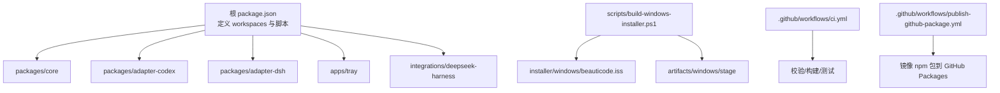
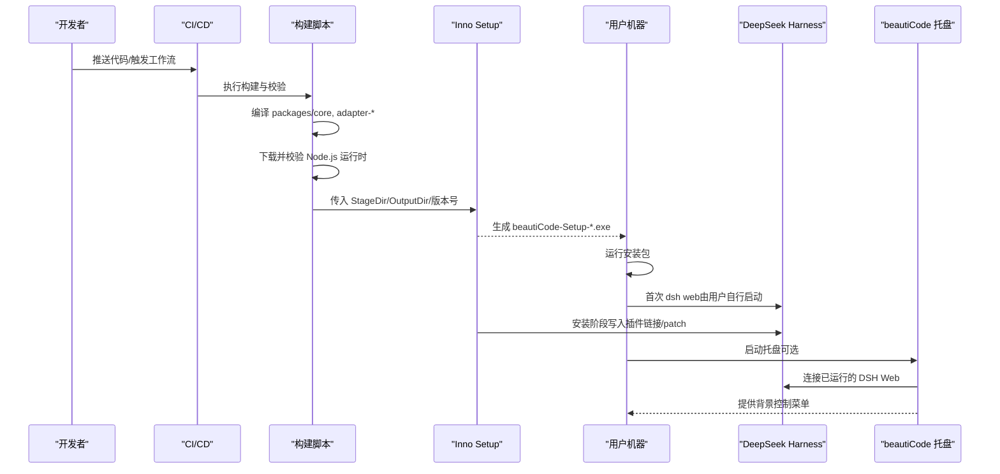
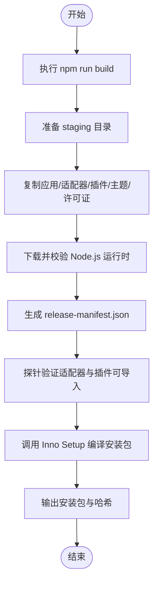
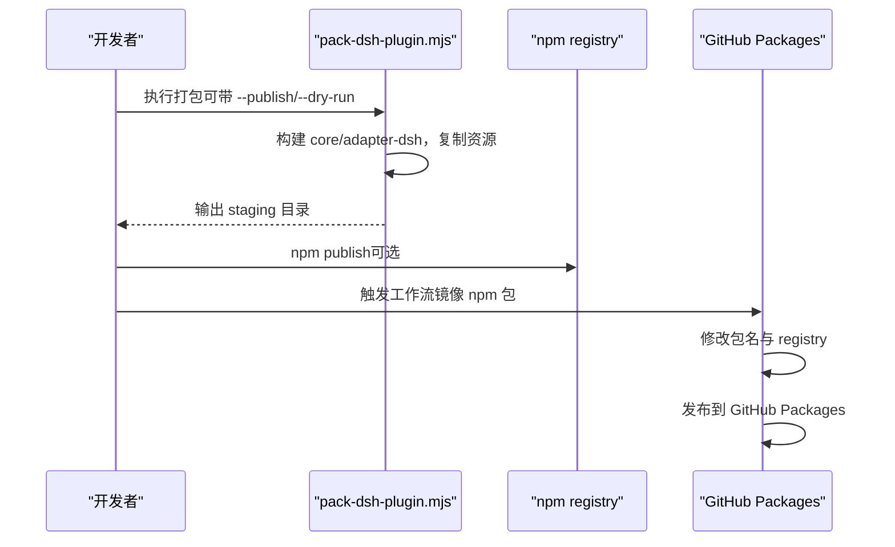
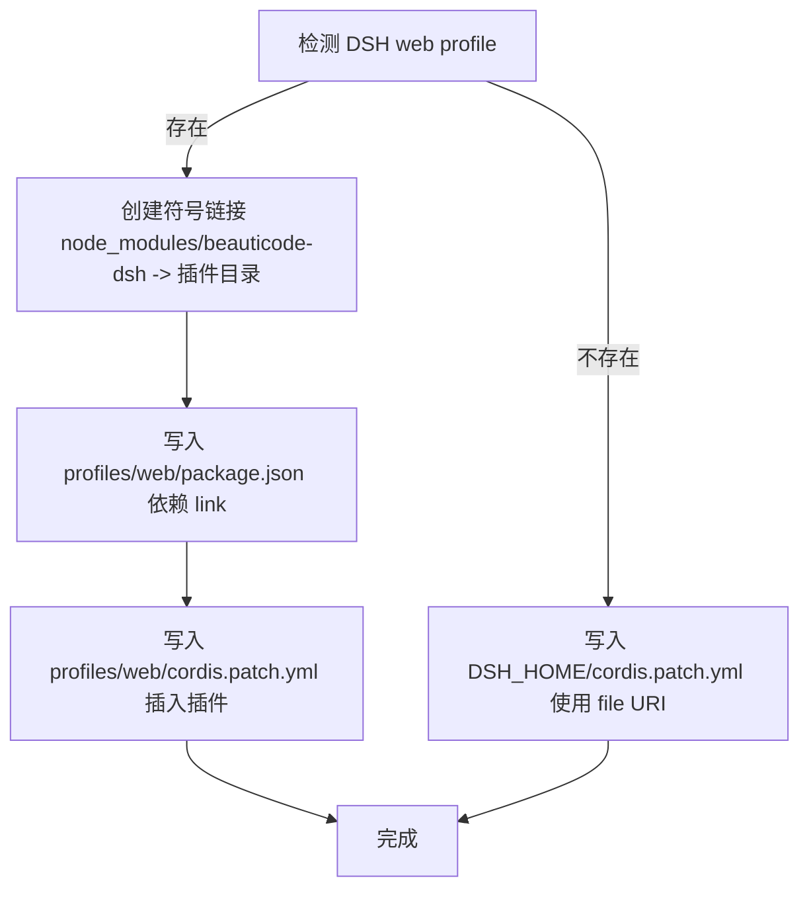
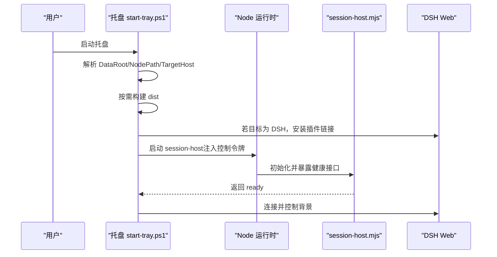
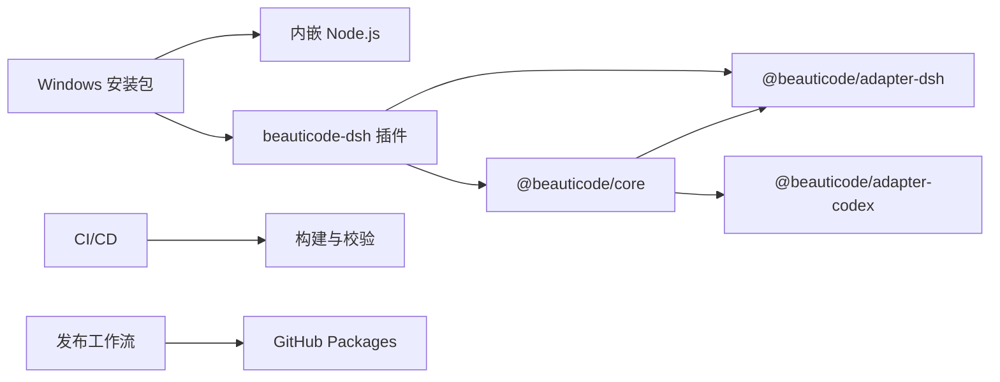

# 部署与分发

<cite>
**本文引用的文件**
- [README.md](file://README.md)
- [package.json](file://package.json)
- [docs/windows-installer.md](file://docs/windows-installer.md)
- [installer/windows/beauticode.iss](file://installer/windows/beauticode.iss)
- [scripts/build-windows-installer.ps1](file://scripts/build-windows-installer.ps1)
- [scripts/install-dsh-plugin.ps1](file://scripts/install-dsh-plugin.ps1)
- [integrations/deepseek-harness/package.json](file://integrations/deepseek-harness/package.json)
- [integrations/deepseek-harness/README.zh-CN.md](file://integrations/deepseek-harness/README.zh-CN.md)
- [scripts/pack-dsh-plugin.mjs](file://scripts/pack-dsh-plugin.mjs)
- [.github/workflows/ci.yml](file://.github/workflows/ci.yml)
- [.github/workflows/publish-github-package.yml](file://.github/workflows/publish-github-package.yml)
- [apps/tray/start-tray.ps1](file://apps/tray/start-tray.ps1)
</cite>

## 目录
1. [简介](#简介)
2. [项目结构](#项目结构)
3. [核心组件](#核心组件)
4. [架构总览](#架构总览)
5. [详细组件分析](#详细组件分析)
6. [依赖关系分析](#依赖关系分析)
7. [性能考虑](#性能考虑)
8. [故障排除指南](#故障排除指南)
9. [结论](#结论)
10. [附录：部署检查清单、更新策略与云原生方案](#附录部署检查清单更新策略与云原生方案)

## 简介
本文件面向运维与交付工程师，提供 beautiCode 的完整部署与分发指南。内容覆盖：
- Windows 安装包构建流程（Inno Setup 配置、依赖打包、资源处理）
- DeepSeek Harness 插件的分发机制（npm 包发布、插件注册）
- 不同部署场景的配置选项（企业、个人、开发）
- 更新机制与版本管理（自动更新检查、回滚策略）
- 部署检查清单、故障排除与性能调优建议
- 容器化与云原生部署参考

beautiCode 为 DeepSeek Harness 和 Codex Desktop 提供本地图片/视频背景能力；Windows 安装包内置 Node.js 运行时，不捆绑 DSH，安装后通过脚本将插件写入用户 DSH 配置。

## 项目结构
仓库采用多工作区组织，核心产物包括：
- 桌面托盘与宿主进程：apps/tray
- 适配器与核心库：packages/core, packages/adapter-codex, packages/adapter-dsh
- DSH 插件：integrations/deepseek-harness
- Windows 安装器：installer/windows/beauticode.iss
- 构建与发布脚本：scripts/*
- CI/CD：.github/workflows/*

图表来源
- [package.json:1-28](file://package.json#L1-L28)
- [scripts/build-windows-installer.ps1:158-343](file://scripts/build-windows-installer.ps1#L158-L343)
- [installer/windows/beauticode.iss:18-65](file://installer/windows/beauticode.iss#L18-L65)
- [.github/workflows/ci.yml:1-59](file://.github/workflows/ci.yml#L1-L59)
- [.github/workflows/publish-github-package.yml:1-57](file://.github/workflows/publish-github-package.yml#L1-L57)

章节来源
- [package.json:1-28](file://package.json#L1-L28)
- [README.md:19-137](file://README.md#L19-L137)

## 核心组件
- Windows 安装包构建器：负责编译产物、下载并校验 Node.js 运行时、拷贝必要资源、生成 Inno Setup 安装包。
- Inno Setup 脚本：定义安装路径、任务（桌面快捷方式、开机自启）、文件复制、图标、运行阶段（安装 DSH 插件、启动托盘）。
- DSH 插件安装器：将插件以符号链接或 home-level patch 形式接入用户 DSH 配置，支持移除。
- DSH 插件打包器：将插件及其依赖（core、adapter-dsh、主题资源）打包为可发布的 npm 包，支持 dry-run 与发布。
- 托盘与宿主：启动 session-host，选择目标宿主（Codex 或 DSH），健康检查、进程生命周期管理、日志输出。

章节来源
- [scripts/build-windows-installer.ps1:158-343](file://scripts/build-windows-installer.ps1#L158-L343)
- [installer/windows/beauticode.iss:18-65](file://installer/windows/beauticode.iss#L18-L65)
- [scripts/install-dsh-plugin.ps1:1-309](file://scripts/install-dsh-plugin.ps1#L1-L309)
- [scripts/pack-dsh-plugin.mjs:1-200](file://scripts/pack-dsh-plugin.mjs#L1-L200)
- [apps/tray/start-tray.ps1:1-800](file://apps/tray/start-tray.ps1#L1-L800)

## 架构总览
下图展示从源码到最终分发的关键路径：构建、打包、安装、插件注册与运行。

图表来源
- [scripts/build-windows-installer.ps1:158-343](file://scripts/build-windows-installer.ps1#L158-L343)
- [installer/windows/beauticode.iss:18-65](file://installer/windows/beauticode.iss#L18-L65)
- [scripts/install-dsh-plugin.ps1:154-297](file://scripts/install-dsh-plugin.ps1#L154-L297)
- [apps/tray/start-tray.ps1:484-494](file://apps/tray/start-tray.ps1#L484-L494)

## 详细组件分析

### Windows 安装包构建流程
- 前置条件：Windows PowerShell 5.1、Node.js 22+、npm 依赖、Inno Setup 6。
- 构建步骤：
  - 执行工作区构建（core、adapter-codex、adapter-dsh）。
  - 创建 staging 目录，复制应用、适配器、插件、主题、许可证等文件。
  - 下载官方 Node.js x64 ZIP，校验 SHA256，放入 runtime。
  - 生成 release-manifest.json（包含 appVersion、nodeVersion、commit、时间戳等）。
  - 调用 Inno Setup 编译器生成安装包。
  - 打印安装包文件名与 SHA256。

图表来源
- [scripts/build-windows-installer.ps1:158-343](file://scripts/build-windows-installer.ps1#L158-L343)

章节来源
- [docs/windows-installer.md:28-54](file://docs/windows-installer.md#L28-L54)
- [scripts/build-windows-installer.ps1:158-343](file://scripts/build-windows-installer.ps1#L158-L343)

### Inno Setup 配置要点
- 安装路径：默认安装至 %LOCALAPPDATA%\Programs\beautiCode。
- 权限与系统要求：最低权限、x64 兼容、最小 Windows 版本。
- 任务选项：创建桌面快捷方式、登录自动启动。
- 文件复制：递归复制 staging 目录内容。
- 图标：使用生成的 .ico。
- 运行阶段：
  - 安装完成后执行 install-dsh-plugin.ps1 将插件写入 DSH profile。
  - 非静默模式启动托盘。
- 卸载阶段：反向执行 install-dsh-plugin.ps1 移除插件链接与 patch。

章节来源
- [installer/windows/beauticode.iss:18-65](file://installer/windows/beauticode.iss#L18-L65)
- [docs/windows-installer.md:3-26](file://docs/windows-installer.md#L3-L26)

### DeepSeek Harness 插件分发机制
- 插件包名：beauticode-dsh（也可通过打包脚本重命名为其他名称）。
- 入口与导出：index.mjs 作为主入口，bin 提供命令行工具。
- 打包流程：
  - 构建 @beauticode/core 与 @beauticode/adapter-dsh。
  - 复制插件文件、主题资源、许可证。
  - 将 core 与 adapter-dsh 的 dist 复制到 vendor，重写 import 路径使其相对可用。
  - 可选择 --dry-run 预览或 --publish 发布到 npm。
- 发布到 GitHub Packages：
  - 工作流从 npm registry 下载指定版本的包，修改 name 为 scoped 名称，设置 registry 为 GitHub Packages，并发布。

图表来源
- [scripts/pack-dsh-plugin.mjs:48-159](file://scripts/pack-dsh-plugin.mjs#L48-L159)
- [.github/workflows/publish-github-package.yml:20-57](file://.github/workflows/publish-github-package.yml#L20-L57)

章节来源
- [integrations/deepseek-harness/package.json:1-60](file://integrations/deepseek-harness/package.json#L1-L60)
- [scripts/pack-dsh-plugin.mjs:1-200](file://scripts/pack-dsh-plugin.mjs#L1-L200)
- [.github/workflows/publish-github-package.yml:1-57](file://.github/workflows/publish-github-package.yml#L1-L57)

### 插件注册流程（安装时）
- 若存在 web profile：
  - 在 profiles/web/node_modules 下创建指向插件目录的符号链接。
  - 在 profiles/web/package.json 中添加依赖 link。
  - 在 cordis.patch.yml 中插入插件条目。
- 若不存在 web profile：
  - 在 DSH_HOME 根目录写入 cordis.patch.yml，使用 file URI 指向插件入口。
- 支持移除：删除链接、patch 条目与依赖项，并清理集成说明文件。

图表来源
- [scripts/install-dsh-plugin.ps1:154-297](file://scripts/install-dsh-plugin.ps1#L154-L297)

章节来源
- [scripts/install-dsh-plugin.ps1:1-309](file://scripts/install-dsh-plugin.ps1#L1-L309)

### 托盘与宿主运行流程
- 托盘启动：
  - 解析数据目录（优先环境变量，其次 LOCALAPPDATA）。
  - 选择 Node 运行时（内置 runtime/node.exe 或系统 node）。
  - 按需构建（仅当 dist 缺失或源文件更新）。
  - 若目标为 DSH，先尝试安装插件链接。
  - 启动 session-host，注入控制令牌，等待就绪。
  - 健康检查与接管已有会话，避免重复启动。
- 日志位置：
  - 托盘日志：%LOCALAPPDATA%\beautiCode\logs\tray.log
  - 引擎日志：%LOCALAPPDATA%\beautiCode\logs\engine-launcher.log

图表来源
- [apps/tray/start-tray.ps1:400-800](file://apps/tray/start-tray.ps1#L400-L800)

章节来源
- [apps/tray/start-tray.ps1:1-800](file://apps/tray/start-tray.ps1#L1-L800)
- [docs/windows-installer.md:75-81](file://docs/windows-installer.md#L75-L81)

## 依赖关系分析
- 构建依赖：
  - Node.js 22+（构建机）
  - Inno Setup 6（Windows 安装包）
  - npm 工作区（core、adapter-codex、adapter-dsh）
- 运行时依赖：
  - Windows 10 1809+（x64）
  - Node.js 运行时（安装包内嵌）
  - DeepSeek Harness（用户自行安装与运行）
- CI 依赖：
  - GitHub Actions（Node 22/24 矩阵）
  - npm registry / GitHub Packages（发布镜像）

图表来源
- [package.json:1-28](file://package.json#L1-L28)
- [integrations/deepseek-harness/package.json:1-60](file://integrations/deepseek-harness/package.json#L1-L60)
- [scripts/build-windows-installer.ps1:206-288](file://scripts/build-windows-installer.ps1#L206-L288)
- [.github/workflows/ci.yml:1-59](file://.github/workflows/ci.yml#L1-L59)
- [.github/workflows/publish-github-package.yml:1-57](file://.github/workflows/publish-github-package.yml#L1-L57)

章节来源
- [package.json:1-28](file://package.json#L1-L28)
- [scripts/build-windows-installer.ps1:206-288](file://scripts/build-windows-installer.ps1#L206-L288)
- [.github/workflows/ci.yml:1-59](file://.github/workflows/ci.yml#L1-L59)

## 性能考虑
- 构建优化：
  - 仅在 dist 缺失或源文件变更时触发构建，减少托盘启动开销。
  - 使用缓存（CI 中的 npm cache）加速依赖安装。
- 运行时优化：
  - 使用内嵌 Node.js 避免环境差异与额外安装。
  - 健康检查与接管已有会话，避免重复启动与端口冲突。
- 资源管理：
  - 主题资源按需复制，避免冗余。
  - 日志分级输出，便于定位问题而不影响性能。

[本节为通用指导，不直接分析具体文件]

## 故障排除指南
- 安装失败：
  - 确认 Inno Setup 6 已安装且可被脚本发现。
  - 检查 staging 目录是否包含所有必需文件（适配器、插件、主题、许可证）。
  - 查看安装日志与集成说明文件（安装目录下的中文说明）。
- 插件未生效：
  - 检查 DSH web profile 是否存在 cordis.patch.yml 与 node_modules 符号链接。
  - 若未初始化 DSH，确认 DSH_HOME 根目录的 cordis.patch.yml 是否正确。
  - 手动执行 install-dsh-plugin.ps1 进行修复或移除。
- 托盘无法启动：
  - 检查日志 %LOCALAPPDATA%\beautiCode\logs\tray.log。
  - 确认 Node 运行时可用（内置或系统）。
  - 若目标为 DSH，确保已运行 dsh web 且端口可达。
- 更新与回滚：
  - 新版本安装包会覆盖旧版本程序文件，但保留用户数据目录（媒体与主题）。
  - 若新版本异常，可回退到上一个稳定版本安装包，并恢复用户数据。

章节来源
- [docs/windows-installer.md:3-26](file://docs/windows-installer.md#L3-L26)
- [scripts/install-dsh-plugin.ps1:252-309](file://scripts/install-dsh-plugin.ps1#L252-L309)
- [apps/tray/start-tray.ps1:16-61](file://apps/tray/start-tray.ps1#L16-L61)
- [docs/windows-installer.md:75-81](file://docs/windows-installer.md#L75-L81)

## 结论
beautiCode 提供了完整的 Windows 安装包构建与 DSH 插件分发能力。通过脚本自动化构建、校验与发布，结合 Inno Setup 实现开箱即用体验。托盘与宿主进程提供健壮的运行期管理与健康检查。配合 CI/CD 与工作流，可实现持续集成与多渠道发布。

[本节为总结性内容，不直接分析具体文件]

## 附录：部署检查清单、更新策略与云原生方案

### 部署检查清单
- 构建环境
  - Windows 10 1809+（x64）
  - PowerShell 5.1
  - Node.js 22+
  - Inno Setup 6
  - npm 依赖已安装
- 构建产物
  - artifacts/windows/stage 包含所有运行时文件
  - release-manifest.json 正确生成
  - 安装包 SHA256 可验证
- 安装与注册
  - 安装路径 %LOCALAPPDATA%\Programs\beautiCode
  - DSH web profile 已链接插件
  - 集成说明文件已生成
- 运行验证
  - 托盘可启动并显示菜单
  - DSH 侧栏“背景”可用
  - 日志无错误（tray.log、engine-launcher.log）

章节来源
- [docs/windows-installer.md:28-54](file://docs/windows-installer.md#L28-L54)
- [scripts/build-windows-installer.ps1:294-343](file://scripts/build-windows-installer.ps1#L294-L343)
- [scripts/install-dsh-plugin.ps1:277-297](file://scripts/install-dsh-plugin.ps1#L277-L297)

### 更新机制与版本管理策略
- 版本来源：
  - 根 package.json 的版本用于安装包命名与 manifest。
  - 插件包独立版本（integrations/deepseek-harness/package.json）。
- 自动更新检查：
  - 当前安装包不包含内置自动更新逻辑；可通过外部机制（如企业软件分发平台）推送新版本。
  - 建议在分发渠道提供版本对比与回滚指引。
- 回滚处理：
  - 保留用户数据目录（%LOCALAPPDATA%\beautiCode），卸载不会删除媒体与主题。
  - 若新版本异常，回退到上一版本安装包并重新安装。

章节来源
- [package.json:1-28](file://package.json#L1-L28)
- [integrations/deepseek-harness/package.json:1-60](file://integrations/deepseek-harness/package.json#L1-L60)
- [docs/windows-installer.md:3-26](file://docs/windows-installer.md#L3-L26)

### 容器化与云原生部署方案
- 容器化思路：
  - 将 DSH 与 beautiCode 插件以容器服务形式部署，通过环境变量注入 BEAUTICODE_DATA_ROOT。
  - 使用卷挂载用户媒体与主题目录，保证数据持久化。
  - 通过反向代理暴露 DSH Web 端口，并限制为内网访问。
- 云原生建议：
  - 使用 Kubernetes Deployment 管理 DSH 与插件服务。
  - 配置健康检查端点（/health）与优雅关闭（/shutdown）。
  - 通过 ConfigMap/Secret 管理插件 patch 与令牌。
  - 监控日志与指标，集中收集 tray.log 与 engine-launcher.log。

[本节为概念性指导，不直接分析具体文件]