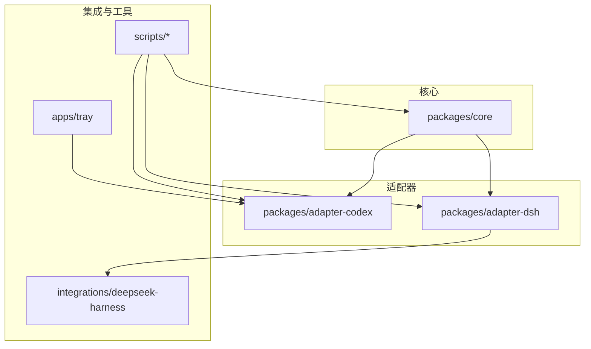
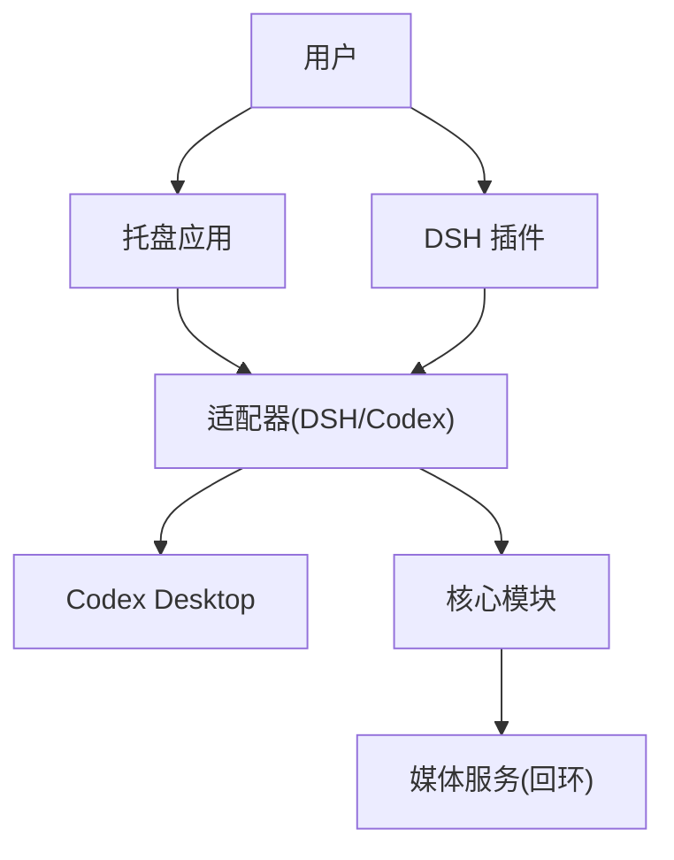
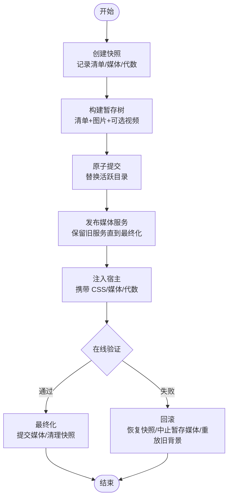
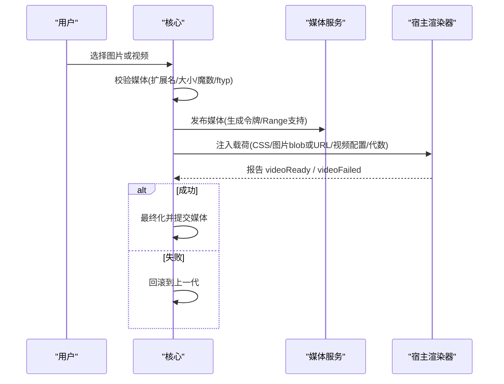
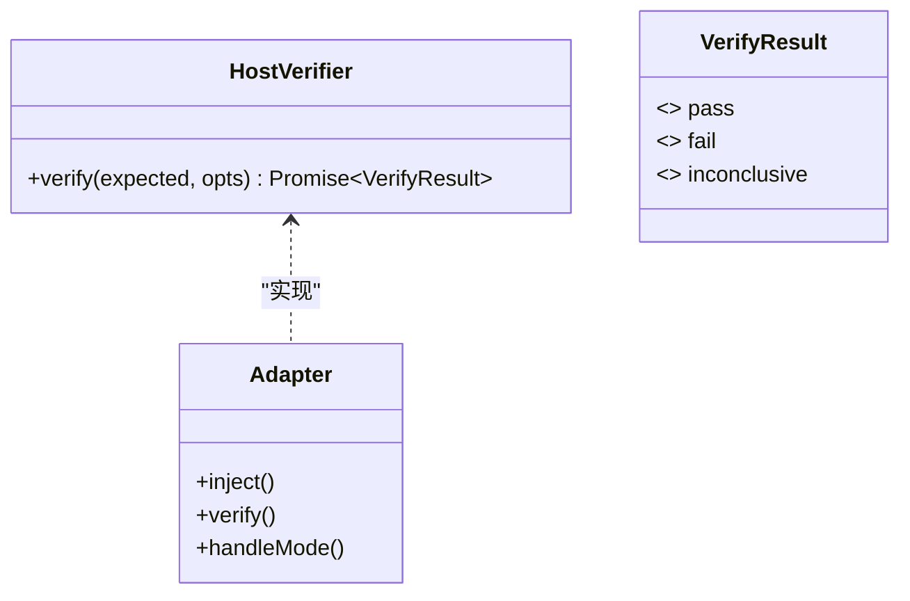
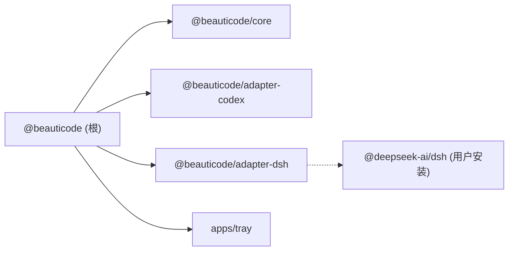

# 项目概述

<cite>
**本文引用的文件**
- [README.md](file://README.md)
- [package.json](file://package.json)
- [NOTICE.md](file://NOTICE.md)
- [THIRD_PARTY_NOTICES.md](file://THIRD_PARTY_NOTICES.md)
- [docs/host-adapter.md](file://docs/host-adapter.md)
- [docs/apply-transaction.md](file://docs/apply-transaction.md)
- [docs/security-boundaries.md](file://docs/security-boundaries.md)
- [docs/media-contract.md](file://docs/media-contract.md)
- [integrations/deepseek-harness/README.zh-CN.md](file://integrations/deepseek-harness/README.zh-CN.md)
</cite>

## 目录
1. [简介](#简介)
2. [项目结构](#项目结构)
3. [核心组件](#核心组件)
4. [架构总览](#架构总览)
5. [详细组件分析](#详细组件分析)
6. [依赖分析](#依赖分析)
7. [性能考虑](#性能考虑)
8. [故障排查指南](#故障排查指南)
9. [结论](#结论)
10. [附录](#附录)

## 简介
beautiCode 是一个本地背景工具，主要面向 DeepSeek Harness（DSH）与 Codex Desktop。它允许将本机图片、动态壁纸、MP4 视频或番剧作为对话与工作区背后的背景层，保持界面交互不受影响。项目采用“适配器 + 核心”的模块化设计：核心负责媒体管理、事务提交与安全边界；适配器分别对接 DSH 插件与 Codex Desktop 宿主环境。

- 目标用户：希望在工作时拥有个性化背景的开发者与创作者。
- 核心价值：让代码工具更贴近生活体验，同时保证工作流不被打断。
- 非官方声明：与 DeepSeek、OpenAI、Codex 等厂商无隶属或合作关系。

**章节来源**
- [README.md:19-35](file://README.md#L19-L35)
- [NOTICE.md:3-28](file://NOTICE.md#L3-L28)

## 项目结构
仓库采用多包工作区组织，便于独立构建与测试：
- packages/core：核心能力（媒体契约、事务、安全边界、媒体服务等）。
- packages/adapter-codex：适配 Codex Desktop（通过 CDP 注入背景层）。
- packages/adapter-dsh：适配 DeepSeek Harness（以 Cordis 插件形式注入浏览器客户端与鉴权接口）。
- integrations/deepseek-harness：DSH 插件资源与说明。
- apps/tray：系统托盘应用（用于 Codex Desktop 场景与热键控制）。
- scripts：构建、打包、安装与测试脚本。
- docs：架构与契约文档（适配器契约、事务流程、安全边界、媒体契约等）。

**图表来源**
- [package.json:7-21](file://package.json#L7-L21)

**章节来源**
- [package.json:1-27](file://package.json#L1-L27)

## 核心组件
- 媒体契约：定义背景清单（manifest）、图片与视频校验规则、播放语义与传输模式（blob/server），确保跨宿主一致性与可回滚性。
- 事务处理机制：快照 → 暂存 → 原子提交 → 发布媒体 → 注入宿主 → 在线验证 → 最终化/回滚，保证磁盘写入成功不等于用户可见成功。
- 安全边界：仅回环通信、严格路径与内容白名单、令牌隔离、失败关闭策略，避免任意文件系统暴露与远程风险。
- 宿主适配器契约：规定 DOM/CSS 注入范围、属性约定、指针事件限制、CDP 安全连接与“摸鱼”模式等行为。

这些组件共同构成 beautiCode 的稳定底座，使不同宿主能以统一方式接入背景能力。

**章节来源**
- [docs/media-contract.md:1-99](file://docs/media-contract.md#L1-L99)
- [docs/apply-transaction.md:1-117](file://docs/apply-transaction.md#L1-L117)
- [docs/security-boundaries.md:1-51](file://docs/security-boundaries.md#L1-L51)
- [docs/host-adapter.md:1-154](file://docs/host-adapter.md#L1-L154)

## 架构总览
beautiCode 采用“核心 + 适配器”的分层架构：
- 核心层：实现媒体契约、事务引擎、媒体服务与安全策略。
- 适配器层：封装与宿主（DSH 插件、Codex Desktop）的交互细节，遵循统一的宿主适配器契约。
- 集成层：提供 DSH 插件资源与托盘应用，简化用户安装与日常操作。
- 脚本层：统一构建、打包、测试与发布流程。

**图表来源**
- [docs/host-adapter.md:18-79](file://docs/host-adapter.md#L18-L79)
- [docs/media-contract.md:84-93](file://docs/media-contract.md#L84-L93)

## 详细组件分析

### 事务处理机制（Apply Transaction）
事务目标是：只有当宿主窗口确认变更生效，才视为成功；否则回滚到快照状态。

关键点：
- 快照与暂存均位于数据根目录下，回滚拒绝越界路径。
- 提交使用独占标记/目录交换，读者遇到进行中标记需拒绝加载。
- 媒体服务在最终化前保持旧实例存活，失败时中止新实例并恢复旧服务。
- 注入载荷包含 CSS、图片数据 URL 或 blob 引用、视频配置与代数；旧代数处理器应忽略事件。
- 在线验证对图像/视频设置最小通过条件，超时或硬失败触发回滚。

**图表来源**
- [docs/apply-transaction.md:7-19](file://docs/apply-transaction.md#L7-L19)
- [docs/apply-transaction.md:21-98](file://docs/apply-transaction.md#L21-L98)

**章节来源**
- [docs/apply-transaction.md:1-117](file://docs/apply-transaction.md#L1-L117)

### 媒体契约与播放语义
- 清单 schema：固定版本、单调递增的 generation、必需的图片 poster、可选的视频。
- 图片校验：扩展名、类型、大小、魔数签名。
- 视频校验：仅 MP4、容器 ftyp 检查、尺寸上限、必须配套图片。
- 播放语义：先显示图片，视频首帧就绪后切换；失败则回滚；切换时释放旧节点避免闪烁。
- 传输模式：优先 blob（Windows 下经 CDP 文件输入），回退到回环 HTTP 服务器（带令牌与 Range/206）。

**图表来源**
- [docs/media-contract.md:5-67](file://docs/media-contract.md#L5-L67)
- [docs/media-contract.md:68-93](file://docs/media-contract.md#L68-L93)

**章节来源**
- [docs/media-contract.md:1-99](file://docs/media-contract.md#L1-L99)

### 宿主适配器契约（DSH 与 Codex）
- DOM 契约：注入全屏舞台与 img/video 节点，html 上设置 data-bc-* 属性表示状态。
- CSS 契约：仅允许舞台定位/堆叠、可见性规则、可选遮罩、必要的主面板透明化；禁止重写编辑器/侧边栏布局。
- CDP 安全：仅 127.0.0.1、限制响应体大小、拒绝跳转、目标身份校验、单观测者所有权。
- 摸鱼模式：进程内开关，隐藏内容 chrome、降低指针捕获、不持久化；通过控制端点启用。
- 声音控制：默认静音，按偏好切换；被阻止时上报 blocked。

**图表来源**
- [docs/host-adapter.md:80-96](file://docs/host-adapter.md#L80-L96)
- [docs/host-adapter.md:97-127](file://docs/host-adapter.md#L97-L127)

**章节来源**
- [docs/host-adapter.md:1-154](file://docs/host-adapter.md#L1-L154)

### 安全认证系统
- 网络边界：仅回环地址（127.0.0.1），禁止 LAN 绑定。
- 文件边界：导入媒体复制进数据根，拒绝符号链接/重解析点；根目录需存在所有权标记。
- 内容门控：图片/视频扩展名、大小、魔数/ftyp 校验；CDP 响应体长度限制。
- 令牌隔离：媒体访问使用随机令牌头，单路由能力，同源校验。
- 失败关闭：缺失 CDP、验证失败、代数漂移等均不宣称成功，必要时回滚。

**章节来源**
- [docs/security-boundaries.md:1-51](file://docs/security-boundaries.md#L1-L51)

### 宿主应用类型、媒体格式与平台兼容性
- 宿主应用：DeepSeek Harness（推荐，通过插件注入）、Codex Desktop（通过托盘与 CDP）。
- 媒体格式：JPG/JPEG/PNG/WebP 图片；MP4 视频。
- 平台：当前主要支持 Windows；源码运行需要 Node.js 22+。

**章节来源**
- [README.md:157-166](file://README.md#L157-L166)
- [README.md:108-118](file://README.md#L108-L118)
- [integrations/deepseek-harness/README.zh-CN.md:1-49](file://integrations/deepseek-harness/README.zh-CN.md#L1-L49)

## 依赖分析
- 工作区依赖：packages/* 与 apps/* 由根 package.json 统一管理构建与测试脚本。
- 运行时要求：Node.js >= 22。
- 第三方依赖：
  - DeepSeek Harness（@deepseek-ai/dsh）为用户自行安装的宿主，非本仓库打包。
  - 媒体服务器设计参考 Codex Dream Skin 的 MIT 许可上游，已改写为 TypeScript 并纳入 core。

**图表来源**
- [package.json:7-21](file://package.json#L7-L21)
- [package.json:23-26](file://package.json#L23-L26)
- [THIRD_PARTY_NOTICES.md:3-10](file://THIRD_PARTY_NOTICES.md#L3-L10)

**章节来源**
- [package.json:1-27](file://package.json#L1-L27)
- [THIRD_PARTY_NOTICES.md:1-63](file://THIRD_PARTY_NOTICES.md#L1-L63)

## 性能考虑
- 媒体传输优先使用 blob 直传，减少 CSP 摩擦与额外 I/O；回退到回环 HTTP 时使用 Range/206 提升大文件播放体验。
- 事务提交采用原子目录交换，避免读者读到混合状态；进行中标记有超时容忍，防止长时间阻塞。
- 视频首帧就绪后再切换，避免闪烁；切换时释放旧节点，避免重复解码与内存泄漏。
- 验证阶段限定超时与重试次数，避免无限等待；硬失败立即回滚，保障用户体验一致性。

[本节为通用指导，无需特定文件引用]

## 故障排查指南
- 无法连接 CDP：确认宿主已启用调试端口且仅监听 127.0.0.1；若构建移除了该支持，会明确报错而非挂起。
- 背景未生效：检查是否通过事务最终化；查看宿主是否报告 videoFailed 或代数不一致；必要时手动清除背景并重试。
- 视频无声：默认静音，需在托盘或控制端点开启声音；若被浏览器阻止，会提示 blocked。
- 摸鱼模式异常：确认当前存在图片/视频背景；退出路径包括托盘菜单、全局热键、清除背景或退出托盘。
- 媒体无效：确认图片扩展名与魔数、视频为 MP4 且具备 ftyp；大小不超过限制；路径在数据根内。

**章节来源**
- [docs/host-adapter.md:68-79](file://docs/host-adapter.md#L68-L79)
- [docs/apply-transaction.md:62-98](file://docs/apply-transaction.md#L62-L98)
- [docs/media-contract.md:43-67](file://docs/media-contract.md#L43-L67)
- [docs/host-adapter.md:97-127](file://docs/host-adapter.md#L97-L127)

## 结论
beautiCode 通过清晰的媒体契约、健壮的事务机制与严格的安全边界，为 DeepSeek Harness 与 Codex Desktop 提供了稳定可靠的本地背景能力。其“核心 + 适配器”的架构使得新增宿主成为可能，同时保持对用户数据的本地化与隐私保护。对于初学者，可从 DSH 插件一键安装入手；对于有经验开发者，可基于适配器契约扩展新的宿主支持或优化媒体处理管线。

[本节为总结性内容，无需特定文件引用]

## 附录

### 许可证与第三方声明
- 本项目软件源代码采用 MIT 许可证。
- 非官方声明：不与 DeepSeek、OpenAI、Anthropic 或任何宿主应用厂商关联。
- 第三方依赖与上游引用详见 THIRD_PARTY_NOTICES.md，其中包含 DeepSeek Harness 与 Codex Dream Skin 的许可与归属信息。

**章节来源**
- [NOTICE.md:7-28](file://NOTICE.md#L7-L28)
- [THIRD_PARTY_NOTICES.md:1-63](file://THIRD_PARTY_NOTICES.md#L1-L63)

### 社区贡献指南（基于仓库现状）
- 开发环境：Node.js 22+；使用 npm 安装依赖并执行根脚本构建与测试。
- 插件安装：可通过 npx 命令或脚本一键安装 DSH 插件；也可手动将本地插件目录加入 DSH。
- 构建与发布：提供 Windows 安装包构建脚本与插件打包/发布脚本。
- 行为准则：遵守安全边界与媒体契约，避免引入任意文件系统暴露或远程下载主题等非 v1 目标。

**章节来源**
- [README.md:41-137](file://README.md#L41-L137)
- [package.json:11-21](file://package.json#L11-L21)
- [docs/security-boundaries.md:46-51](file://docs/security-boundaries.md#L46-L51)