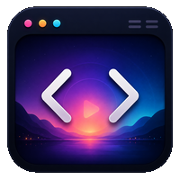

<div align="center">
  <h1>beautiCode</h1>
  
</div>

<p align="center">
  <strong>把你喜欢的画面，放进 vibe coding 的每一分钟。</strong>
</p>

<p align="center">
  为 DeepSeek Harness 添加图片与视频背景，也支持 Codex Desktop。<br>
  可以是一张壁纸，也可以是一部番剧、一场电影，或者一段陪你度过漫长工作的风景。
</p>

<p align="center">
  <strong>工作不一定只能盯着灰色界面。</strong>
</p>


---


## 它是什么？

beautiCode 是一个本地背景工具，**主要面向 DeepSeek Harness**。

安装包已内置兼容的 DeepSeek Harness 运行时。启动 beautiCode，选中 DeepSeek Harness，就可以把电脑里的：

* 图片
* 动态壁纸
* MP4 视频
* 番剧
* 电影
* MV
* 风景延时摄影

直接设成 DeepSeek Harness 网页背后的背景。

它不会把工作窗口变成一个播放器，而是让画面安静地待在对话和工作区后面。

代码、输入框和按钮仍然可以正常使用。

你也可以继续把它用在 Codex Desktop 上；同一套托盘，启动时选一下目标即可。


---

## 一边工作，一边看点喜欢的

有时候并不是想认真看完一整部电影。

只是希望写代码、等 AI 回复、跑构建或者排查 Bug 时，屏幕上不那么单调。

beautiCode 可以让你：

* 把番剧放在 DeepSeek Harness 背景中循环播放
* 导入本地电影，边工作边慢慢看
* 使用动漫场景作为动态背景
* 播放演唱会、MV 或直播录像
* 放一段雨夜、海边、城市航拍作为工作氛围
* 在等待模型执行任务时随手摸一会儿鱼

视频默认静音，不会突然打断工作。

需要声音时，也可以随时打开。

> 不是逃离工作，而是给漫长的工作过程，留一点属于自己的空间。


### v1.0.0 安装包

想直接使用 beautiCode，可以下载 [Windows 安装包](https://github.com/starsstreaming/beautiCode/releases/tag/v1.0.0)。
安装包自带 Node.js 和 DeepSeek Harness 运行时，不需要另外安装 Node.js、npm 或 DSH。
启动后选择 **DeepSeek Harness** 即可；也可以从开始菜单打开「beautiCode · DeepSeek Harness」直接进入。
同一安装包仍可选 Codex Desktop。


---

## 摸鱼模式

按下快捷键：

```text
Ctrl + Shift + Space
```

即可进入摸鱼模式。

进入后：

* DeepSeek Harness 的主要内容暂时隐藏
* 图片或视频完整显示
* 视频保持正常播放
* 再按一次快捷键即可回到工作界面

适合这些时刻：

* 模型正在执行一个较长的任务
* 项目正在编译
* 下载或测试还没结束
* 想暂停几分钟看看番
* 想把工作页临时变成一个小播放器

不用退出 DeepSeek Harness，也不用在多个窗口之间来回切换。

工作和摸鱼，只差一次快捷键。

---


## 保存喜欢的背景

遇到喜欢的图片或视频，可以保存成一个主题。

例如：

```text
雨夜写代码
进击的巨人
赛博城市
海边下午
电影摸鱼
深夜电台
```

保存后，可以直接从托盘菜单切换。

对于视频主题，beautiCode 还会记录播放进度。

下次重新打开这个主题时，可以从上次看到的位置继续播放。

不是每一次打开，都必须从片头重新开始。

---

## 工作时不会太抢眼

首页可以完整展示背景，让画面更有氛围。

进入项目或会话后，工作区域会自动变暗一些，避免视频影响文字阅读。

侧栏、输入框和主要按钮仍然可以正常操作。

背景不会抢走鼠标，也不会挡住点击。

它更像一层安静的环境，而不是盖在 DeepSeek Harness 上面的播放器。


---

## 使用方式

### Windows 安装包（推荐）

运行：

```text
beautiCode-Setup-1.0.0-win-x64.exe
```

安装包自带 Node.js 和 DeepSeek Harness 运行时。使用者不需要安装 Node.js、npm、DSH，也不需要保留项目源码。

安装完成后启动 beautiCode，在选择框里点 **DeepSeek Harness**。Windows 右下角会出现托盘图标，浏览器会打开本机 DSH 页面。

之后在托盘里：

* 点「应用或重新应用」：如果 DSH 还没启动，会先拉起它并打开网页；如果网页已经关掉，会重新打开
* 更换图片或视频
* 清除背景、开关声音、摸鱼、保存和切换主题

退出托盘不会结束 DeepSeek Harness，避免打断正在进行的工作。

当前安装包尚未进行商业代码签名，Windows 可能显示 SmartScreen 提示。
用户导入的图片、视频和已保存主题位于
`%LOCALAPPDATA%\beautiCode`，卸载程序默认保留这些数据。

### 从源码运行

源码开发需要 Node.js 22 或更高版本。在项目目录执行：

```bash
npm install
npm run tray:dsh
```

只启动 DeepSeek Harness：

```powershell
powershell -NoProfile -ExecutionPolicy Bypass -File .\scripts\start-beauticode-dsh.ps1
```

构建 Windows 安装包：

```powershell
npm run installer:windows
```

输出位于：

```text
artifacts\windows\installer\
```

通过托盘菜单可以：

* 更换图片
* 更换视频
* 清除背景
* 打开或关闭视频声音
* 进入摸鱼模式
* 保存当前主题
* 切换已保存主题
* 删除主题


## 当前支持情况

目前主要支持：

* Windows
* DeepSeek Harness（推荐）
* Codex Desktop
* JPG、JPEG、PNG、WebP 图片
* MP4 视频


## 关于本地视频

beautiCode 只读取你主动选择的本地图片和视频。

项目不会提供番剧、电影或其他受版权保护的内容。

请只导入你拥有或有权使用的媒体文件，并遵守当地法律与内容版权要求。

---

## 为什么叫 beautiCode？

因为代码工具不一定只能是冰冷、统一和毫无个性的。

有人喜欢极简黑色。

有人喜欢雨夜城市。

有人喜欢动漫。

有人喜欢在漫长的构建过程中，重新看一遍熟悉的电影。

工具应该帮助人完成工作。

但好的工具，也应该允许人把自己带进工作里。

> **我们每天花很多时间面对代码。
> beautiCode 想做的，只是让这些时间更像生活，而不只是等待完成的任务。**

---

## 致谢

beautiCode 的部分媒体处理思路与实现经验参考并改编自：

* Codex Dream Skin
L站的支持：
https://linux.do/
相关开源许可、代码来源和修改说明见：

```text
THIRD_PARTY_NOTICES.md
```

beautiCode 是非官方项目，与 DeepSeek、OpenAI、Codex 或其他应用厂商没有隶属或合作关系。

DeepSeek Harness 的接入说明见 [`docs/deepseek-harness.md`](docs/deepseek-harness.md)。

---

## License

MIT
